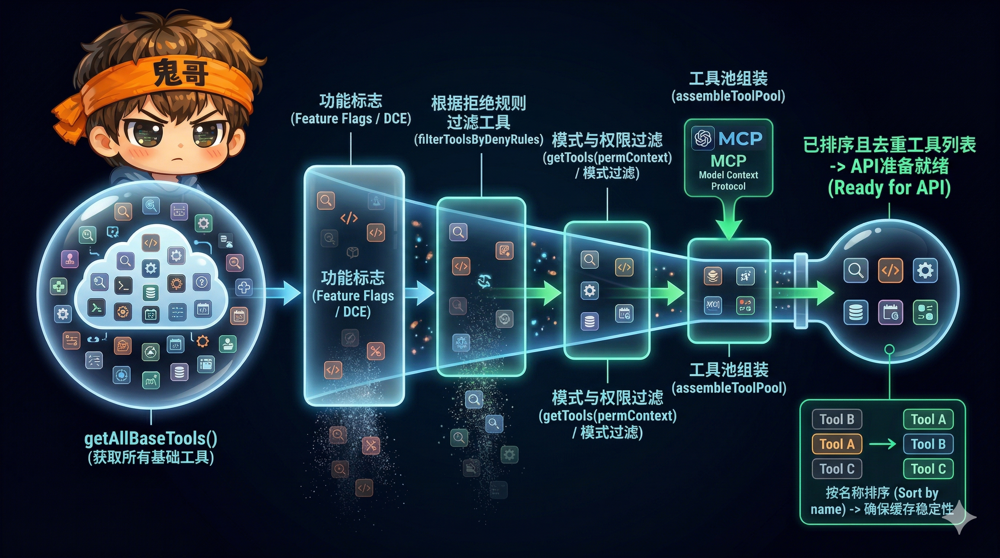
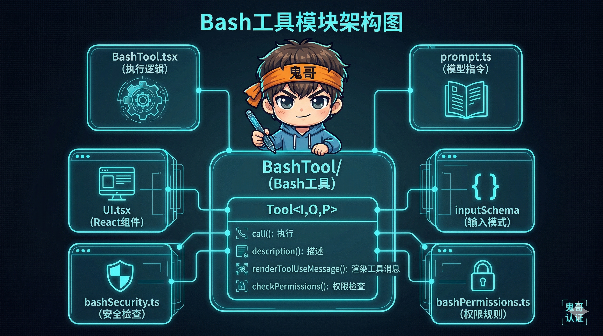

# 解剖 Claude Code（四）：50 个工具的统一契约——Tool System 设计

> Claude Code 有超过 50 个工具：Bash、文件读写、网络搜索、子 Agent 派生、MCP 扩展……它们形态各异，但共享一份类型契约 `Tool<Input, Output, Progress>`。这套设计让"增加一个工具"变成了填表格式的标准操作，同时把安全、权限、并发的复杂性全部下沉到框架层。


<!-- IMG_04_COVER -->

---

## 问题

一个 Agent 的能力边界取决于它能调用什么工具。Claude Code 面临的工具管理挑战是：

- **数量庞大**：50+ 内置工具 + 无限 MCP 扩展工具
- **安全性差异巨大**：`Grep` 只读无害，`Bash` 可以 `rm -rf /`
- **并发语义不同**：两个 `Read` 可以并行，但 `Bash` 写文件时其他工具必须等待
- **加载成本高**：50 个工具的 Schema 约 15K Token，全部发给 API 浪费缓存
- **生命周期复杂**：输入验证 → 权限检查 → 执行 → 结果格式化 → Hook 回调，每一步都可能中断

如果每个工具各自为政，这些横切关注点会被重复实现 50 遍。Claude Code 的解法是一份**统一类型契约**加一条**标准化执行管线**。

---

## 在整体架构中的位置

```
ReAct 循环的每一轮：
  Phase 1: 上下文准备   ← 工具 Schema 在这里注入
  Phase 2: 模型调用     ← 模型从工具列表中选择调用
  Phase 3: 工具执行     ← Tool System 在这里运行
  Phase 4: 结果收集     ← 工具输出格式化后回传
```

工具系统横跨 Phase 1 到 Phase 4——从决定哪些工具可见，到执行调用、格式化结果。

---

## Part 1：`Tool<I, O, P>` 统一类型契约

### 三个泛型参数

Claude Code 的每个工具都是一个 `Tool<Input, Output, Progress>` 类型的实例：

```typescript
type Tool<
  Input extends AnyObject,    // Zod Schema → 输入验证
  Output,                      // call() 的返回数据类型
  Progress extends ToolProgressData  // 执行过程中的进度事件
>
```

| 泛型 | 约束 | 用途 |
|------|------|------|
| `Input` | 必须是 Zod Object Schema | 编译时类型安全 + 运行时自动验证 |
| `Output` | 无约束 | 工具输出的结构化数据 |
| `Progress` | 继承 `ToolProgressData` | 长时间运行工具的流式进度上报 |

这意味着每个工具的输入在到达 `call()` 之前**已经被 Zod 验证过**——类型安全不依赖工具作者的自律，而是框架强制保证。

### 七大方法族

`Tool` 类型定义了约 30 个字段，可以归纳为七个功能族：

```
┌─────────────────────────────────────────────────────┐
│                  Tool<I, O, P>                       │
├──────────┬──────────────────────────────────────────┤
│ 执行     │ call(), validateInput()                   │
│ Schema   │ inputSchema, inputJSONSchema, outputSchema│
│ 元数据   │ name, aliases, searchHint                 │
│ 自省     │ description(), prompt(), userFacingName() │
│ 安全     │ checkPermissions(), isReadOnly(),         │
│          │ isDestructive(), toAutoClassifierInput()  │
│ 并发     │ isConcurrencySafe()                       │
│ 渲染     │ renderToolUseMessage(),                   │
│          │ renderToolResultMessage(),                │
│          │ mapToolResultToToolResultBlockParam()     │
└──────────┴──────────────────────────────────────────┘
```

每个工具都必须回答这些问题：
- **我怎么执行？** → `call()`
- **我的输入长什么样？** → `inputSchema`
- **我只读吗？** → `isReadOnly()`
- **我可以和别人并行吗？** → `isConcurrencySafe()`
- **执行我需要什么权限？** → `checkPermissions()`
- **我的结果怎么展示？** → `renderToolResultMessage()`

### `buildTool()` 与 Fail-Closed 默认值

工具作者不需要实现所有 30 个字段。`buildTool()` 函数提供了**安全侧的默认值**：

```typescript
const TOOL_DEFAULTS = {
  isEnabled:          () => true,
  isConcurrencySafe:  () => false,   // 假设不安全
  isReadOnly:         () => false,   // 假设会写入
  isDestructive:      () => false,
  checkPermissions:   (input) => ({ behavior: 'allow', updatedInput: input }),
  toAutoClassifierInput: () => '',
  userFacingName:     () => '',
}

function buildTool<D extends ToolDef>(def: D): BuiltTool<D> {
  return { ...TOOL_DEFAULTS, userFacingName: () => def.name, ...def }
}
```

关键设计——**fail-closed**（失败时关闭）：

| 默认值 | 含义 | 安全影响 |
|--------|------|----------|
| `isConcurrencySafe → false` | 默认不允许并行 | 防止并发写入冲突 |
| `isReadOnly → false` | 默认假设有副作用 | 触发权限检查 |
| `toAutoClassifierInput → ''` | 默认跳过分类器 | 不自动放行 |

**如果工具作者忘了声明并发安全性，系统会保守地串行执行**——宁可慢，不可错。这和网络安全中的"默认拒绝"是同一个思想。

---

## Part 2：从 50 个工具到 API 请求——注册与加载管线


<!-- IMG_04_TOOL_PIPELINE -->

### 集中注册：`getAllBaseTools()`

所有内置工具在 `src/tools.ts` 中集中注册。这个文件是工具系统的 Single Source of Truth：

```typescript
// src/tools.ts — 条件导入模式
const SleepTool = feature('PROACTIVE') || feature('KAIROS')
  ? require('./tools/SleepTool/SleepTool.js').SleepTool
  : null

function getAllBaseTools(): readonly Tool[] {
  return [
    BashTool,
    FileReadTool,
    FileEditTool,
    FileWriteTool,
    GlobTool,
    GrepTool,
    AgentTool,
    WebSearchTool,
    WebFetchTool,
    // ... 50+ 工具
    SleepTool,        // 可能为 null
    WorktreeTool,     // 可能为 null
  ].filter(Boolean)   // 编译时死代码消除 + 运行时 null 过滤
}
```

**注意两个去除模式**：
1. **编译时 DCE（Dead Code Elimination）**：`feature()` 是编译时常量，关闭的功能在打包时被完全移除
2. **运行时过滤**：`.filter(Boolean)` 移除 `null` 值

### 四级过滤管线

从注册到实际发送给 API，工具经过四级过滤：

```
getAllBaseTools()          50+ 内置工具
       │
       ▼
  Feature Flags / DCE     编译时移除未启用功能的工具
       │
       ▼
  filterToolsByDenyRules  按权限规则移除被禁止的工具
       │
       ▼
  getTools(permContext)   按 PermissionMode 过滤
       │                  + isEnabled() 运行时检查
       ▼
  assembleToolPool()      合并 MCP 工具，去重，排序
       │
       ▼
  API Request             最终工具列表 → toolToAPISchema()
```

**排序是关键细节**：工具按名称排序，内置工具在前、MCP 工具在后。为什么？因为工具定义在 API 请求中占固定位置——**任何字节变化都会打破 Prompt Cache**。排序保证了同一组工具在不同轮次中的字节顺序一致。

### Deferred Loading：延迟加载

50 个工具的 Schema 约 15K Token。全部发送不仅浪费 Token 预算，还占用宝贵的上下文窗口。Claude Code 的解法是**延迟加载**：

```
工具是否延迟？
  │
  ├── alwaysLoad: true      → 永不延迟（核心工具）
  ├── isMcp: true           → 默认延迟（MCP 扩展工具）
  ├── shouldDefer: true     → 明确标记延迟
  └── ToolSearchTool 自身   → 永不延迟（元工具）
```

延迟的工具在 API 请求中只发送名称（标记 `defer_loading: true`），完整 Schema 在模型通过 `ToolSearchTool` 主动查询时才加载：

```typescript
// API 请求中的延迟工具
{
  name: "mcp__slack__send_message",
  defer_loading: true    // 只发名称，不发 Schema
}

// 模型需要时调用 ToolSearchTool
ToolSearch({ query: "slack send" })
→ 返回完整 Schema，模型才能调用该工具
```

**启用条件**：
- 默认模式（`tst`）：所有 MCP 和 `shouldDefer` 工具延迟
- 自动模式（`tst-auto`）：延迟工具的 Token 超过上下文的 10% 时启用
- 关闭模式（`standard`）：所有工具全量发送

### Schema 缓存：保护 Prompt Cache

工具 Schema 转换为 API 格式时使用**会话级缓存**：

```typescript
// src/utils/api.ts
const TOOL_SCHEMA_CACHE = new Map()

function toolToAPISchema(tool) {
  const cacheKey = tool.inputJSONSchema 
    ? `${tool.name}:${hash(tool.inputJSONSchema)}` 
    : tool.name
  
  if (TOOL_SCHEMA_CACHE.has(cacheKey)) {
    return TOOL_SCHEMA_CACHE.get(cacheKey)
  }
  
  const schema = tool.inputJSONSchema 
    ? tool.inputJSONSchema        // MCP 工具直接用 JSON Schema
    : zodToJsonSchema(tool.inputSchema)  // 内置工具从 Zod 转换
  
  TOOL_SCHEMA_CACHE.set(cacheKey, schema)
  return schema
}
```

**为什么需要缓存？** 工具定义在 API 请求中排在位置 2（system prompt 之前）。如果 Schema 的任何字节发生变化——哪怕是 GrowthBook 功能开关的翻转导致某个字段出现/消失——都会让下游约 11K Token 的工具块全部缓存失效。Schema 缓存把字节锁定在会话首次计算的结果上。

---

## Part 3：工具执行管线

### 六步流水线

当模型决定调用一个工具时，执行流程如下：

```
模型请求: tool_use { name: "Bash", input: { command: "ls" } }
       │
       ▼
  ① Zod Schema 验证 ─── 失败 → 返回 InputValidationError
       │
       ▼
  ② 自定义验证 validateInput() ─── 失败 → 返回自定义错误
       │
       ▼
  ③ Pre-Tool Hooks ─── 可覆盖权限 / 修改输入 / 阻止执行
       │
       ▼
  ④ 权限检查 checkPermissions() ─── deny → 返回拒绝消息
       │                            ask  → 弹窗询问用户
       │                            allow → 继续
       ▼
  ⑤ 执行 call() ─── 成功 → Post-Tool Hooks
       │                    失败 → PostToolUseFailure Hooks
       ▼
  ⑥ 结果格式化 mapToolResultToToolResultBlockParam()
       │
       ▼
  返回 tool_result 给模型
```

每一步都是独立的拦截点，失败时立即短路返回——**工具作者只需要关注 `call()` 的实现**，其余步骤由框架处理。

### Lazy Schema 与语义类型转换

工具的输入 Schema 使用 **Lazy Schema** 模式——延迟到首次访问时才构造：

```typescript
// src/utils/lazySchema.ts
function lazySchema<T>(factory: () => T): () => T {
  let cached: T | undefined
  return () => (cached ??= factory())
}

// BashTool 中的使用
const fullInputSchema = lazySchema(() => z.strictObject({
  command: z.string(),
  timeout: semanticNumber(z.number().optional()),
  run_in_background: semanticBoolean(z.boolean().optional()),
  _simulatedSedEdit: z.object({...}).optional()  // 内部字段
}))

// 暴露给模型的 Schema 排除了内部字段
const inputSchema = lazySchema(() =>
  fullInputSchema().omit({ _simulatedSedEdit: true })
)
```

**三个设计意图**：
1. **避免循环依赖**：模块加载时不构造 Schema，避免依赖链问题
2. **条件字段**：可以根据功能开关动态排除字段（如 `run_in_background`）
3. **Schema 隐私**：`_simulatedSedEdit` 是内部字段，不暴露给模型

另一个精妙细节是 `semanticNumber()` 和 `semanticBoolean()`——它们允许模型发送字符串 `"5000"` 并自动转换为数字 `5000`。这降低了模型的格式错误率。

### 权限三决策模型

`checkPermissions()` 返回三种决策之一：

```typescript
type PermissionResult =
  | { behavior: 'allow', updatedInput?: Input }   // 放行，可修改输入
  | { behavior: 'ask',   message: string }         // 询问用户
  | { behavior: 'deny',  message: string }         // 拒绝
```

**`allow` 可以修改输入**——这不是理论上的可能性，而是实际使用的模式。例如 Bash 工具在沙箱模式下会把命令包装进沙箱前缀，通过 `updatedInput` 传回修改后的命令。

**`ask` 附带建议**：

```typescript
// ask 决策可以附带权限规则建议
{
  behavior: 'ask',
  message: 'Allow running npm install?',
  suggestions: [
    { toolName: 'Bash', pattern: 'npm install *', behavior: 'allow' }
  ]
}
```

用户批准后，建议的规则可以被保存为永久权限——**一次询问，永久放行同类操作**。

### Hook 生命周期

工具执行前后有三类 Hook：

| Hook | 时机 | 能力 |
|------|------|------|
| `PreToolUse` | 权限检查之前 | 覆盖权限决策、修改输入、阻止执行 |
| `PostToolUse` | 执行成功之后 | 修改输出、添加上下文 |
| `PostToolUseFailure` | 执行失败之后 | 添加错误上下文、建议重试 |

Hook 可以是 shell 命令、HTTP 端点或回调函数，超时时间 10 分钟。**PreToolUse Hook 甚至可以绕过权限系统**——这为 CI/CD 环境中的自动化场景提供了入口。

### 并发安全与 StreamingToolExecutor

上一篇提到的 `StreamingToolExecutor` 在工具层面的并发规则：

```
工具 A 请求执行：
  │
  ├── 当前无执行中的工具 → 直接执行
  │
  ├── A.isConcurrencySafe() === true
  │   且所有执行中的工具也是 concurrencySafe
  │   → 并行执行
  │
  └── 否则 → 排队等待
```

**只有 Bash 工具的错误会取消兄弟工具**。原因：Bash 命令之间可能有依赖关系（先 `mkdir`，后 `cp`），一个失败意味着后续也会失败。但 `Read` 失败不影响 `Grep`——它们是独立的。

---

## Part 4：解剖一个工具


<!-- IMG_04_TOOL_ANATOMY -->

以 BashTool 和 GlobTool 为代表，看完整工具和最小工具的对比：

### GlobTool——最小实现

```typescript
export const GlobTool = buildTool({
  name: 'Glob',
  searchHint: 'find files by name pattern or wildcard',
  maxResultSizeChars: 100_000,

  get inputSchema() { return inputSchema() },

  // 自省声明
  isConcurrencySafe: () => true,    // 只读搜索，可并行
  isReadOnly: () => true,           // 无副作用

  // 权限检查委托给通用读权限
  async checkPermissions(input, ctx) {
    return checkReadPermissionForTool(GlobTool, input, ctx)
  },

  // 执行——核心只有 5 行
  async call(input, { abortController, globLimits }) {
    const start = Date.now()
    const { files, truncated } = await glob(
      input.pattern, this.getPath(input),
      { limit: globLimits?.maxResults ?? 100 },
      abortController.signal
    )
    return {
      data: { filenames: files, durationMs: Date.now() - start,
              numFiles: files.length, truncated }
    }
  },

  // 结果格式化
  mapToolResultToToolResultBlockParam(data, toolUseID) {
    return { type: 'tool_result', tool_use_id: toolUseID,
             content: [{ type: 'text', text: data.filenames.join('\n') }] }
  },
  // ... 渲染方法
})
```

**18 行核心代码**。`buildTool()` 处理了其余一切——验证、默认值、生命周期。

### BashTool——完整实现

BashTool 是最复杂的工具，展示了类型契约的全部能力：

```typescript
export const BashTool = buildTool({
  name: 'Bash',

  // ① Schema 隐私：内部字段不暴露给模型
  get inputSchema() {
    return fullInputSchema().omit({ _simulatedSedEdit: true })
  },

  // ② 自定义验证：阻止轮询模式
  async validateInput(input) {
    if (isBlockedSleepPattern(input.command)) {
      return { result: false, message: 'Avoid polling loops...' }
    }
    return { result: true }
  },

  // ③ 权限检查：AST 解析 + 语义安全 + 规则匹配 + AI 分类器
  async checkPermissions(input, context) {
    return bashToolHasPermission(input, context)
    // 内部流程：
    // 1. 解析 Bash AST 提取子命令
    // 2. 语义安全检查（沙箱、重定向）
    // 3. 路径约束检查
    // 4. 匹配权限规则（支持 "git *" 通配符）
    // 5. AI 分类器预测安全性
    // 6. 默认：询问用户
  },

  // ④ 执行：异步生成器 + 流式进度
  async call(input, context, canUseTool, parentMessage, onProgress) {
    const generator = runShellCommand({ command: input.command, ... })
    let result
    do {
      result = await generator.next()
      if (!result.done && onProgress) {
        onProgress({
          toolUseID: `bash-progress-${counter++}`,
          data: {
            type: 'bash_progress',
            output: result.value.output,
            elapsedTimeSeconds: result.value.elapsed,
            totalLines: result.value.lines,
          }
        })
      }
    } while (!result.done)
    return { data: result.value }
  },

  // ⑤ 安全自省：动态判断
  isConcurrencySafe: () => true,
  isReadOnly: (input) => isReadOnlyCommand(input.command),
  isDestructive: (input) => isDestructiveCommand(input.command),

  // ⑥ 大输出持久化：超过 30KB 写入磁盘
  maxResultSizeChars: 30_000,
  // ... 渲染方法
})
```

注意 BashTool 的 `isReadOnly()` 和 `isDestructive()` 是**输入感知的**——同一个工具，`ls` 是只读的，`rm -rf` 是破坏性的。这不是工具级别的静态声明，而是**输入级别的动态判断**。

### `ToolUseContext`——执行上下文

每个工具的 `call()` 方法接收一个 `ToolUseContext` 对象，它是工具与系统交互的唯一接口：

```typescript
type ToolUseContext = {
  // 执行控制
  abortController: AbortController     // 取消信号
  messages: Message[]                   // 完整对话历史

  // 状态管理
  readFileState: FileStateCache         // 文件读取 LRU 缓存
  getAppState(): AppState               // 全局应用状态
  setAppState(f): void                  // 更新状态

  // UI 能力
  setToolJSX?: SetToolJSXFn             // 渲染自定义 UI
  addNotification?: (notif) => void     // 发送通知

  // 环境信息
  options: {
    tools: Tools                        // 所有可用工具（供 ToolSearch 查询）
    mcpClients: MCPServerConnection[]   // MCP 服务器连接
    mainLoopModel: string               // 当前模型
    isNonInteractiveSession: boolean    // 是否非交互模式
    // ...
  }
}
```

**注意 `readFileState`**：这是一个 LRU 缓存，跟踪当前会话中已读过的文件。当 `FileReadTool` 发现文件内容没变时，返回 `type: 'file_unchanged'` 哨兵值而不是完整内容——**避免在对话历史中重复填充相同的文件内容**。

### `ToolResult<T>`——输出不只是数据

```typescript
type ToolResult<T> = {
  data: T                    // 工具输出数据
  newMessages?: Message[]    // 注入额外消息到对话
  contextModifier?: (ctx: ToolUseContext) => ToolUseContext  // 修改后续上下文
  mcpMeta?: { ... }          // MCP 协议元数据
}
```

`ToolResult` 的设计让工具不只是"返回一个值"。通过 `newMessages`，工具可以向对话注入系统消息（例如 FileReadTool 注入文件元数据提示）。通过 `contextModifier`，工具可以改变后续工具的执行环境——**但只有非并发安全的工具才能使用 `contextModifier`**，防止并行执行时的竞态条件。

---

## 为什么这样设计

### 1. 类型契约 vs 接口继承

Claude Code 没有用 `abstract class BaseTool`，而是用 TypeScript 类型 + `buildTool()` 工厂函数。原因：

- **组合优于继承**：工具是配置对象，不是类层次结构
- **Fail-closed 默认值**：通过对象展开（spread）实现，比 `super()` 调用更不容易忘记
- **Dead Code Elimination**：对象字面量比类更容易被打包工具优化

### 2. 延迟加载的 Token 经济学

50 个工具的 Schema ≈ 15K Token。如果加上 MCP 扩展可能翻倍。延迟加载把大多数工具缩减为几个 Token 的名称，只在模型真正需要时加载完整 Schema。代价是多一次 `ToolSearchTool` 调用——但这一次调用的成本远低于每轮都发送完整 Schema。

### 3. 输入感知的安全声明

`isReadOnly(input)` 而不是 `isReadOnly()`——这个设计选择让 Bash 这样的"万能工具"可以根据具体命令动态调整安全等级。如果是工具级别的静态声明，Bash 只能永远标记为"非只读"，导致每次执行都需要权限确认。

### 4. Schema 缓存保护 Prompt Cache

这是上一篇（缓存分割）的延伸。工具 Schema 在 API 请求中排在系统提示之前，任何字节变化都会级联打破缓存。Session-scoped 的 Schema 缓存确保即使底层状态变化（GrowthBook 开关翻转、MCP 重连），发送给 API 的 Schema 字节保持一致。

### 5. Hook 作为扩展点而非改代码

`PreToolUse` / `PostToolUse` Hook 让外部系统可以介入工具执行，而不需要修改工具代码。CI/CD 系统可以通过 Hook 自动批准特定操作；审计系统可以通过 Hook 记录每次工具调用。这让工具系统成为**开放的管线**而非封闭的黑盒。

---

## 可借鉴的模式

### 模式一：Fail-Closed 默认值模式

```
规则：所有安全相关的默认值都应该偏向保守侧。
实现：工厂函数提供默认值，工具作者只需覆盖确认安全的部分。
适用场景：任何需要管理多个组件安全属性的系统。
```

不要期望每个贡献者都记得声明安全属性。把系统设计成"忘了声明 = 最保守行为"。

### 模式二：Schema 隐私与语义类型转换

```
规则：发给模型的 Schema 和内部使用的 Schema 可以不同。
实现：fullSchema.omit({ internalField: true }) 创建公开 Schema。
      semanticNumber() / semanticBoolean() 容忍格式偏差。
适用场景：任何 LLM 驱动的工具调用系统。
```

模型不是完美的 JSON 生成器。**容忍它的小错误**（字符串 vs 数字），**隐藏它不需要知道的字段**。

### 模式三：注册-过滤-排序管线

```
规则：工具集合经过多级过滤后才发送给 API。
实现：DCE → 权限规则 → 运行时检查 → 合并排序 → 延迟加载。
      排序保证 Prompt Cache 稳定性。
适用场景：任何需要动态工具集合且关注 API 成本的 Agent 系统。
```

工具列表不是静态配置，而是一条过滤管线。每一级过滤解决不同的关注点（编译时优化 vs 运行时权限 vs Token 成本），最终产出一个排序稳定、缓存友好的工具集合。

---

## 下一篇预告

工具让 Agent 有了"手脚"，但 Agent 的"大脑"需要记忆。Claude Code 的五层记忆体系——从毫秒级的会话消息到永久持久化的 Checkpoint——如何让一个无状态的 API 调用表现得像"记得一切"？下一篇，我们拆解记忆系统。

---

| 篇 | 标题 | 状态 |
|----|------|------|
| [01](/part1-foundation/ch01-architecture) | 512K 行代码，一个终端里的 Agent Runtime | ✅ |
| [02](/part1-foundation/ch02-react-loop) | ReAct 循环：`while(true)` 里的五个阶段与七层恢复 | ✅ |
| [03](/part1-foundation/ch03-cache-compression) | Prompt 缓存分割与四级上下文压缩 | ✅ |
| **04** | **50 个工具的统一契约：Tool System 设计**（本篇） | ✅ |
| 05 | 五层记忆体系：从短期到持久化 | 🔄 下一篇 |
| 06 | 纵深防御：23 项安全检查与"不信任任何输入" | ⬚ |
| 07 | 投机执行与自研状态管理：隐藏延迟的两个利器 | ⬚ |
| 08 | 多 Agent 编排：三种执行模型与 Coordinator 模式 | ⬚ |
| 09 | 在终端里造一个浏览器：自定义 Ink 渲染引擎 | ⬚ |
| 10 | Bridge 与协议层：让 VS Code、Web、Mobile 共享一个 Claude | ⬚ |
| 11 | Skill、Plugin、Hook：三层扩展的设计谱系 | ⬚ |
| 12 | 回顾：从 Claude Code 中提炼的 10 个 Agent 工程模式 | ⬚ |
