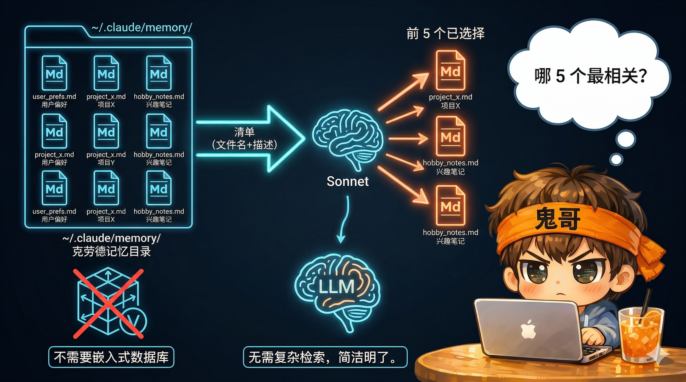

# 解剖 Claude Code（五）：五层记忆体系——从毫秒到永久

> 每一次 API 调用都是无状态的——模型没有"记忆"。但 Claude Code 让你感觉它"记得一切"：记得你上次改了哪个文件，记得你偏好简洁的代码风格，甚至记得三周前你说过"不要在测试里 Mock 数据库"。这背后是一个五层记忆体系，从毫秒级的会话消息到永久持久化的 Checkpoint，每一层解决不同时间尺度的记忆需求。


<!-- IMG_05_COVER -->

---

## 问题

一个基于 API 的 Agent 面临三个记忆挑战：

1. **单次对话内**：上下文窗口有限（200K Token），对话越长越贵
2. **跨会话**：API 调用之间没有状态，昨天的对话今天全忘了
3. **跨项目**：用户的偏好和习惯应该在不同项目中保持一致

没有记忆系统的 Agent 就像一个每五分钟重启一次的同事——每次都要重新自我介绍。

Claude Code 的解法是五层记忆，每层覆盖不同的时间尺度：

| 层 | 时间尺度 | 存储 | 用途 |
|----|----------|------|------|
| 短期记忆 | 毫秒~分钟 | 内存 | 当前对话的消息历史 |
| 工作记忆 | 分钟~小时 | 内存 | 任务状态、进度追踪 |
| 长期记忆 | 天~永久 | 磁盘 | 用户偏好、项目知识、反馈 |
| 摘要记忆 | 对话生命周期 | 磁盘+消息 | AI 提取的关键信息 |
| 检查点 | 永久 | 磁盘 | 完整会话持久化与恢复 |

---

## 在整体架构中的位置

```
记忆系统贯穿 ReAct 循环的所有阶段：

  Phase 1: 上下文准备
    ├── 长期记忆 → 注入系统提示（CLAUDE.md + auto-memory）
    ├── 摘要记忆 → 压缩后的历史注入上下文
    └── 短期记忆 → 完整消息历史

  Phase 3: 工具执行
    └── 工作记忆 → 任务状态读写、文件缓存

  Phase 5: 循环决策
    └── 检查点 → 每条消息持久化到 JSONL
```

---

## Layer 1：短期记忆——会话消息数组

最基础的记忆层：一个 `Message[]` 数组，在 `QueryEngine` 中维护。

```typescript
// src/QueryEngine.ts
class QueryEngine {
  private mutableMessages: Message[]  // 随对话增长的消息数组
}
```

每条消息是一个带类型标签的结构体：

```typescript
// 用户消息
{ type: 'user', uuid, content: ContentBlock[], isMeta?: boolean }

// 助手消息
{ type: 'assistant', uuid, content: [TextBlock, ToolUseBlock, ThinkingBlock, ...] }

// 工具结果（作为用户消息的一部分）
{ type: 'tool_result', tool_use_id, content: [TextBlock | ImageBlock] }
```

**关键特征**：
- **无自动截断**：消息只增不减，直到触发压缩
- **文件读取去重**：`readFileState`（LRU 缓存，100 条，25MB 上限）追踪已读文件。当文件内容未变时，`FileReadTool` 返回 `type: 'file_unchanged'` 哨兵值而非完整内容——避免对话历史被重复文件内容撑满
- **元消息标记**：`isMeta: true` 标记系统注入的消息（如文件元数据提示），压缩时可以优先丢弃

短期记忆的寿命就是当前对话。对话结束，内存释放，消息消失——除非被检查点层持久化。

---

## Layer 2：工作记忆——任务状态与进行中追踪

工作记忆存储在 `AppState` 中，追踪当前会话中正在进行的工作：

```typescript
// src/state/AppStateStore.ts
type AppState = {
  tasks: { [taskId: string]: TaskState }     // 后台任务状态
  foregroundedTaskId?: string                // 当前前台任务
  agentNameRegistry: Map<string, AgentId>    // Agent 名称注册表
  todos: { [agentId: string]: TodoList }     // 待办列表
  toolPermissionContext: ToolPermissionContext // 权限上下文
  // ...
}
```

**任务状态**是工作记忆的核心：

```typescript
type TaskStateBase = {
  id: string          // 前缀 ID：b(bash)/a(agent)/r(remote)/t(teammate)...
  status: 'pending' | 'running' | 'completed' | 'failed' | 'killed'
  description: string
  startTime: number
  endTime?: number
  outputFile: string  // 输出持久化到磁盘的路径
  notified: boolean   // 用户是否已被通知完成
}
```

**工作记忆的特殊属性**：
- **仅存于内存**：不自动持久化到磁盘，会话结束即消失
- **明确排除于长期记忆**：memory 系统的指令明确写道"不要保存进行中的工作、临时状态、当前对话上下文"
- **输出持久化分离**：任务输出写入磁盘文件（`outputFile`），但任务状态本身只在内存

这个设计是有意为之：工作记忆是**瞬时的工作台**，而非**档案柜**。一个正在运行的 `npm install` 不需要被记住——它的结果（成功或失败）才重要。

---

## Layer 3：长期记忆——跨会话持久化

长期记忆分为两个子系统：**CLAUDE.md 层级结构**和 **Auto-Memory 自动记忆**。

### 3.1 CLAUDE.md 四级层次结构

CLAUDE.md 是一种"被动记忆"——开发者手动维护的指令文件，按四级优先级加载：

```
优先级从低到高：

①  /etc/claude-code/CLAUDE.md        ← Managed（组织级策略）
②  ~/.claude/CLAUDE.md               ← User（用户全局偏好）
③  项目根目录/CLAUDE.md              ← Project（项目约定，受版本控制）
    项目根目录/.claude/CLAUDE.md
    项目根目录/.claude/rules/*.md
④  项目根目录/CLAUDE.local.md        ← Local（个人项目覆盖，不受版本控制）
```

**后加载的优先级更高**——Local 覆盖 Project，Project 覆盖 User。

**条件规则**是一个精妙设计。`.claude/rules/` 目录下的规则文件可以声明 `paths` 前置数据，只在编辑匹配的文件时生效：

```markdown
---
paths: ["src/server/**/*.ts", "src/api/**/*.ts"]
---

# 后端代码规范
- 使用 4 空格缩进
- 所有 API 端点必须有错误处理
```

这条规则只在你编辑后端文件时注入——编辑前端代码时完全不可见。

**@include 指令**允许文件互相引用，最深 5 层：

```markdown
# CLAUDE.md
@./docs/coding-style.md
@./docs/api-conventions.md
```

### 3.2 Auto-Memory 自动记忆

Auto-Memory 是"主动记忆"——Claude 在对话过程中自动识别并保存值得记住的信息。

**存储结构**：

```
~/.claude/
  └── projects/
      └── <project-slug>/
          └── memory/
              ├── MEMORY.md           ← 索引文件（最多 200 行）
              ├── user_role.md        ← 用户画像
              ├── feedback_testing.md ← 反馈：测试偏好
              ├── project_auth.md     ← 项目：认证重构背景
              └── reference_linear.md ← 引用：Linear 项目地址
```

**四种记忆类型**：

| 类型 | 触发 | 示例 |
|------|------|------|
| `user` | 了解到用户的角色、偏好 | "用户是数据科学家，关注可观测性" |
| `feedback` | 用户纠正或确认某种做法 | "集成测试必须用真实数据库，不能 Mock" |
| `project` | 了解到项目的背景、决策 | "Auth 中间件重写是合规驱动，非技术债" |
| `reference` | 了解到外部系统的位置 | "Pipeline bug 在 Linear 'INGEST' 项目中追踪" |

**每个记忆文件使用 YAML 前置数据**：

```markdown
---
name: 测试策略偏好
description: 用户强烈偏好集成测试用真实数据库
type: feedback
---

集成测试必须使用真实数据库连接，不要 Mock。

**Why:** 上季度 Mock 测试通过但生产环境迁移失败。
**How to apply:** 编写测试时选择真实 DB 连接；只在单元测试隔离场景中 Mock。
```

### 3.3 LLM 驱动的记忆检索

这是 Claude Code 记忆系统最独特的设计——**没有向量数据库，没有 Embedding，用 LLM 做检索**。


<!-- IMG_05_LONG_TERM_RETRIEVAL -->

检索流程：

```
1. 扫描 memory/ 目录下所有 .md 文件
   → 提取 frontmatter（filename, description, type）
   → 生成 manifest（最多 200 个文件的摘要列表）

2. 调用 Sonnet，传入 manifest + 当前查询
   → "从这 200 个记忆文件中选出最多 5 个与当前对话最相关的"
   
3. 返回 Top-5 文件路径
   → 读取完整内容
   → 注入上下文
```

```typescript
// src/memdir/findRelevantMemories.ts
async function findRelevantMemories(
  query: string,
  memoryDir: string,
  signal: AbortSignal,
  recentTools: readonly string[],
  alreadySurfaced: ReadonlySet<string>,  // 避免重复推荐
): Promise<RelevantMemory[]>
```

**为什么不用 Embedding？**

- **维护成本为零**：没有索引构建、没有向量数据库、没有同步问题
- **语义理解更强**：LLM 可以理解"用户正在写测试"→"测试偏好记忆相关"，这种推理 Embedding 余弦相似度做不到
- **数据量适中**：200 个记忆文件的 description 总共不过几千 Token，Sonnet 一次调用足矣
- **去重内置**：`alreadySurfaced` 参数确保同一记忆不会在一次对话中反复推荐

这是"No Index Philosophy"的延伸——不建索引，靠 LLM 的推理能力做检索。

### 3.4 记忆注入到系统提示

长期记忆通过两条路径注入：

```
路径 1：静态注入（每轮都存在）
  CLAUDE.md 内容 → getUserContext() → 作为 claudeMd 上下文
  MEMORY.md 索引 → loadMemoryPrompt() → 系统提示动态区

路径 2：动态注入（按需）
  findRelevantMemories() → 检索 Top-5 → 作为 nested_memory 附件
  条件规则 → 匹配当前编辑的文件 → 注入匹配的规则内容
```

**MEMORY.md 索引文件**限制在 200 行、25KB 以内——这是一个精心计算的预算。索引太大会侵蚀上下文窗口空间；太小则覆盖不了足够的记忆。200 行足以索引大多数项目的记忆集合。

---

## Layer 4：摘要记忆——AI 提取的关键信息

当对话变长时，完整的消息历史太贵（Token 成本）也太大（上下文窗口）。摘要记忆提供了一种中间方案——**用 AI 提取关键信息，丢弃细节**。

### 4.1 Session Memory（持续提取）

Session Memory 是一个在对话过程中**持续运行的后台提取器**：

```
触发条件（同时满足）：
  · Token 数超过初始化阈值（~40K）
  · 自上次提取后新增 ≥ 30K Token
  · 自上次提取后 ≥ 5 次工具调用

提取方式：
  · 后台 fork 一个子 Agent
  · 用当前对话调用 Claude 提取关键信息
  · 写入 ~/.claude/sessions/ 下的 Markdown 文件
  · 非阻塞——主对话继续进行
```

Session Memory 是**增量的**——每次提取不会重写整个文件，而是追加新发现的关键信息。它的定位是"对话中的笔记本"：不是完整记录，而是重要事项的速记。

### 4.2 Compaction（全量摘要）

当上下文窗口接近极限时，Compaction 机制触发全量摘要（第三篇已详细分析）：

```typescript
// src/services/compact/compact.ts
// 调用 Claude Opus 生成对话摘要
const summary = await summarizeConversation(messages)

// 创建压缩边界消息
const boundary = createCompactBoundaryMessage({
  summary,
  compactDirection: 'full',  // 或 'partial'
  // 保留：文件差异、计划状态、技能附件
})
```

**Compaction 与 Session Memory 的关系**：
- Session Memory 是**预防性的**——在上下文还充裕时提取关键信息
- Compaction 是**应急性的**——在上下文快满时压缩历史
- 两者互补：即使 Compaction 丢失了细节，Session Memory 的提取结果仍然保留在磁盘上

### 4.3 Compact 边界消息的元数据保留

Compaction 不仅仅是"把对话总结一下"。边界消息会保留关键的结构化元数据：

```
压缩前的信息 → 压缩后保留
  · 文件编辑差异      → FileHistorySnapshot
  · 计划状态          → Plan 附件
  · 技能状态          → Skill 附件
  · Git 分支          → 每条消息的 gitBranch 字段
  · 归因追踪          → AttributionSnapshot
```

这意味着 Compaction 之后，Claude 仍然知道"在这次对话中修改了哪些文件"——即使具体的修改讨论已经被压缩成一句话。

---

## Layer 5：检查点——完整会话持久化

检查点层是记忆系统的"地基"——它把所有消息逐条持久化到磁盘，使任何会话都可以恢复。

### 5.1 JSONL 会话文件

```
~/.claude/projects/{project-slug}/{sessionId}.jsonl
```

**格式**：每行一个 JSON 对象（JSON Lines），追加写入。

```json
{"type":"user","uuid":"abc-123","content":[...],"timestamp":"...","cwd":"/...","sessionId":"..."}
{"type":"assistant","uuid":"def-456","content":[...],"parentUuid":"abc-123","gitBranch":"main"}
{"type":"file-history-snapshot","messageId":"def-456","trackedFileBackups":{...}}
```

**写入机制**：

```typescript
// src/utils/sessionStorage.ts
// 缓冲写入：100ms 间隔批量刷盘
// 每批最多 100MB
// 文件权限 0o600（仅用户可读写）
```

**追加只写（Append-Only）设计的好处**：
- **崩溃安全**：进程崩溃时，已写入的消息不会丢失
- **无锁并发**：不需要文件锁，只追加不修改
- **部分恢复**：即使最后一行写入不完整，跳过即可

### 5.2 会话恢复

```bash
# CLI 恢复命令
claude --continue {sessionId}
claude --resume {sessionId}
```

恢复流程：

```
1. 读取 JSONL 文件 → 重建 Message[] 数组
2. 恢复 parentUuid 链 → 重建消息层级关系
3. 恢复文件历史快照 → 知道哪些文件被修改过
4. 恢复归因快照 → 知道 Claude 贡献了多少代码
5. 恢复 Context Collapse 状态 → 重建压缩边界
6. 恢复工作树状态 → 如果在 worktree 中，chdir 回去
7. 恢复 Todo 列表 → 从最后一个 TodoWrite 工具调用中提取
8. 恢复元数据 → 会话标题、标签、Agent 名称/颜色
```

**尾窗口优化**：会话元数据（标题、标签、模式）在会话退出时重新追加到文件末尾。这样读取元数据只需读取最后 64KB（`LITE_READ_BUF_SIZE`），不需要解析整个 JSONL 文件。

### 5.3 会话文件的延迟创建

```
会话开始 → 消息缓冲在 pendingEntries[] 中
         → 不创建文件

第一条真实消息 → materializeSessionFile()
              → 刷入缓冲 + 创建 JSONL 文件
```

**为什么延迟？** 用户可能打开 Claude Code 又立刻关闭，或者只执行了 Hook/附件操作。延迟创建避免产生大量空会话文件。

### 5.4 子 Agent 的会话文件

子 Agent 的会话独立存储：

```
~/.claude/projects/{project-slug}/{sessionId}/
  ├── {sessionId}.jsonl                    ← 主会话
  └── subagents/
      └── agent-{agentId}.jsonl            ← 子 Agent 会话
```

每个子 Agent 有独立的 JSONL 文件，通过 `isSidechain: true` 标记与主会话区分。

---

## 五层协同：一个完整的记忆生命周期

以一个具体场景说明五层如何协同：

```
用户："帮我重构 auth 模块，之前说过不要 Mock 数据库"

① 长期记忆检索
   → findRelevantMemories() 调用 Sonnet
   → 匹配到 feedback_testing.md："集成测试必须用真实数据库"
   → 匹配到 project_auth.md："Auth 重写是合规驱动"
   → 注入上下文

② CLAUDE.md 加载
   → 项目 CLAUDE.md 加载代码规范
   → .claude/rules/backend.md 匹配 src/auth/ → 注入后端规范

③ 短期记忆
   → 当前对话消息数组提供即时上下文
   → readFileState 缓存避免重复读取文件

④ 工作记忆
   → TaskState 追踪重构进度
   → Todo 列表记录剩余步骤

⑤ 对话进行 30 分钟后...
   → Session Memory 后台提取："用户正在重构 auth 模块，关注合规需求"
   → 每条消息持久化到 JSONL

⑥ 对话超过 150K Token...
   → Compaction 触发：压缩早期对话，保留文件修改记录
   → 压缩后的摘要成为新的上下文起点

⑦ 用户关闭终端，明天恢复...
   → claude --continue → 从 JSONL 恢复完整状态
   → 长期记忆中的 feedback 和 project 记忆仍然可用
```

---

## 为什么这样设计

### 1. 五层而非一层

每一层解决不同的时间尺度问题。如果只有短期记忆（消息数组），对话长了就撑爆上下文；如果只有长期记忆（文件），就无法高效处理进行中的任务状态。五层的设计让每种信息在最合适的位置存储和访问。

### 2. LLM 检索而非向量数据库

200 个记忆文件 × 一行 description ≈ 几千 Token。这个数据量不需要向量数据库——一次 Sonnet 调用就能完成检索，而且语义理解能力远超 Embedding 余弦相似度。这是**用推理替代索引**的又一个例子。

### 3. CLAUDE.md 的四级层次

从组织级策略到个人覆盖，四级层次完美映射了企业中的配置管理模式：
- 组织策略不可覆盖（`/etc/claude-code/CLAUDE.md`）
- 个人偏好跨项目通用（`~/.claude/CLAUDE.md`）
- 项目约定受版本控制、团队共享（`CLAUDE.md`）
- 个人覆盖不提交到仓库（`CLAUDE.local.md`）

### 4. 追加只写的 JSONL

选择 JSONL 而非 SQLite 或 JSON 文件，核心原因是**崩溃安全**。Agent 运行时可能执行危险操作导致进程崩溃——追加只写确保已记录的消息不会丢失。这和数据库的 WAL（Write-Ahead Log）是同一个思想。

### 5. 记忆的显式排除

长期记忆系统明确列出"不应保存"的内容：代码模式、Git 历史、调试方案、临时任务状态。这些都可以从当前代码或 `git log` 中获得——重复保存不仅浪费空间，还会导致记忆与现实不一致（记忆说函数叫 `foo()`，但已经重命名为 `bar()`）。

---

## 可借鉴的模式

### 模式一：LLM-as-Retriever

```
规则：当数据量在数百条以内时，用 LLM 做检索比建向量数据库更简单、更准确。
实现：生成 manifest（名称+描述列表）→ 调用小模型选择 Top-K → 读取完整内容。
适用场景：个人知识库、项目文档检索、配置文件选择。
```

### 模式二：分层记忆与时间尺度对齐

```
规则：不同生命周期的信息应该存储在不同的层。
实现：内存（秒级）→ 会话文件（分钟级）→ 结构化文件（天级）→ 持久化存储（永久）。
适用场景：任何需要管理多种生命周期数据的系统。
```

### 模式三：Append-Only 持久化

```
规则：对崩溃敏感的状态使用追加只写格式。
实现：JSONL 格式 + 缓冲写入 + 尾窗口元数据。
适用场景：会话记录、审计日志、事件溯源。
```

---

## 下一篇预告

记忆让 Agent 记住了该做什么、不该做什么。但在它执行之前，还有一道关卡——**安全**。Claude Code 的 23 项 Bash 安全检查、6 层纵深防御、沙箱隔离和 AI 分类器，构成了一个"不信任任何输入"的安全体系。下一篇，我们拆解安全系统。

---

| 篇 | 标题 | 状态 |
|----|------|------|
| [01](/part1-foundation/ch01-architecture) | 512K 行代码，一个终端里的 Agent Runtime | ✅ |
| [02](/part1-foundation/ch02-react-loop) | ReAct 循环：`while(true)` 里的五个阶段与七层恢复 | ✅ |
| [03](/part1-foundation/ch03-cache-compression) | Prompt 缓存分割与四级上下文压缩 | ✅ |
| [04](/part2-core/ch04-tool-system) | 50 个工具的统一契约：Tool System 设计 | ✅ |
| **05** | **五层记忆体系：从短期到持久化**（本篇） | ✅ |
| 06 | 纵深防御：23 项安全检查与"不信任任何输入" | 🔄 下一篇 |
| 07 | 投机执行与自研状态管理：隐藏延迟的两个利器 | ⬚ |
| 08 | 多 Agent 编排：三种执行模型与 Coordinator 模式 | ⬚ |
| 09 | 在终端里造一个浏览器：自定义 Ink 渲染引擎 | ⬚ |
| 10 | Bridge 与协议层：让 VS Code、Web、Mobile 共享一个 Claude | ⬚ |
| 11 | Skill、Plugin、Hook：三层扩展的设计谱系 | ⬚ |
| 12 | 回顾：从 Claude Code 中提炼的 10 个 Agent 工程模式 | ⬚ |
