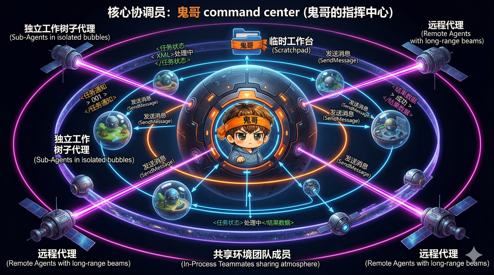
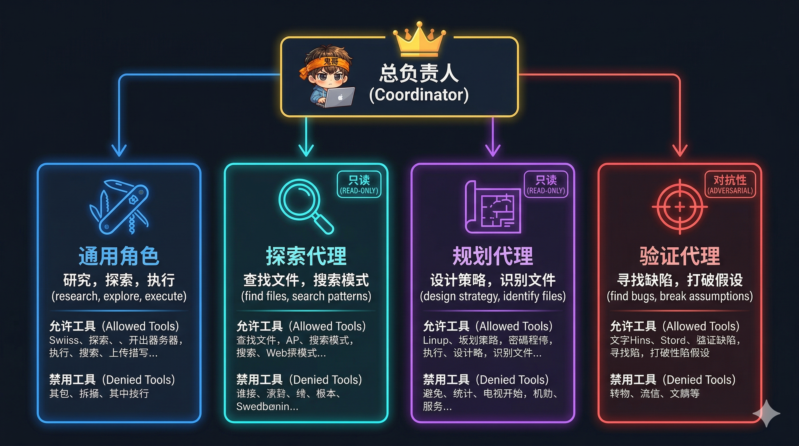

# 解剖 Claude Code（八）：多 Agent 编排——三种执行模型与 Coordinator 模式

> 一个 Agent 做所有事情，迟早会撞上上下文窗口的天花板。Claude Code 的解法是**多 Agent 编排**：一个 Coordinator 指挥多个 Worker，每个 Worker 在独立的 Git Worktree 中工作，通过 SendMessage 协调，用 Scratchpad 共享知识。三种执行模型（Sub-Agent、In-Process Teammate、Remote Agent）分别覆盖了不同的隔离-性能取舍。


<!-- IMG_08_COVER -->

---

## 问题

单 Agent 模式有三个天花板：

1. **上下文窗口**：一个复杂任务需要读几十个文件、执行几十个工具——200K Token 上下文很快就满了
2. **串行瓶颈**：一个 Agent 一次只能做一件事。研究 A 模块和研究 B 模块必须串行
3. **模型成本**：用 Opus 做简单搜索太贵，用 Haiku 做复杂推理太弱

多 Agent 编排通过**分而治之**解决这些问题：Coordinator 负责规划和综合，Worker 负责执行具体任务，每个 Worker 有独立的上下文窗口、可以并行工作、可以使用不同的模型。

---

## 在整体架构中的位置

```
用户请求
   │
   ▼
Coordinator（编排层）
   │
   ├── Agent("research auth module")  → Worker A（Worktree 隔离）
   ├── Agent("research api module")   → Worker B（Worktree 隔离）
   └── Agent("check test coverage")   → Worker C（后台运行）
   │
   ▼
Coordinator 综合结果 → 下发实施指令
   │
   └── Agent("implement changes based on ...")  → Worker D
```

---

## 统一入口：AgentTool

所有 Agent 派生都通过一个统一的 `AgentTool` 完成。路由逻辑根据输入参数决定走哪条路径：

```
Agent({
  prompt,             // 任务描述
  subagent_type?,     // 'Explore' | 'Plan' | 'general-purpose' | ...
  model?,             // 'sonnet' | 'opus' | 'haiku'
  isolation?,         // 'worktree' | 'remote'
  run_in_background?, // true → 异步
  name?,              // Agent 名称（用于 SendMessage 路由）
  team_name?,         // 团队名称（触发 Teammate 模式）
})

路由决策：
  team_name + name → In-Process Teammate（模型二）
  isolation: 'remote' → Remote Agent（模型三）
  isolation: 'worktree' → Sub-Agent + Git Worktree（模型一）
  默认（fork 开关开启）→ Forked Sub-Agent
  否则 → 普通 Sub-Agent
```

一个工具接口，三种执行模型——调用者不需要关心底层差异。

---

## 模型一：Sub-Agent（Forked + Worktree 隔离）

Sub-Agent 是最常用的模型：**独立上下文 + 独立文件系统**。

### 执行流程

```
1. 父 Agent 调用 Agent(prompt, isolation: 'worktree')
2. 创建 Git Worktree → 独立的工作目录副本
3. Fork Agent Context：
   · 共享：系统提示、模型配置 → 命中 Prompt Cache
   · 隔离：消息历史、文件状态缓存、AbortController
4. 子 Agent 在 Worktree 中执行工具（独立的上下文窗口）
5. 完成后检测 Worktree 变更：
   · 有改动 → 保留 Worktree 供用户审查
   · 无改动 → 自动清理 Worktree
6. 返回结果给父 Agent
```

### Git Worktree 隔离

Worktree 提供**文件系统级隔离**而非进程级隔离：

```
主仓库：/project/                  Worktree：/project/.claude/worktrees/agent-abc/
  ├── src/auth.ts  ← 主副本         ├── src/auth.ts  ← 独立副本
  ├── src/api.ts                    ├── src/api.ts
  └── node_modules/ ─────────────── └── node_modules/ → 符号链接（共享）
```

**符号链接优化**：`node_modules`、`.turbo` 等大目录不复制，而是符号链接回主仓库——避免 500K+ 文件的复制开销。

**变更检测**：子 Agent 完成后，比较 Worktree 的 HEAD 和创建时的 commit。无变更则自动清理——不留任何痕迹。

### 上下文隔离的价值

```
父 Agent 上下文：         子 Agent 上下文：
  150K Token 已使用         0 Token（全新开始）
  30 个文件的读取记录        独立的文件读取缓存
  复杂的对话历史             只有一条 prompt

→ 子 Agent 有完整的 200K Token 预算
→ 可以深入研究而不影响父 Agent 的上下文
```

### Prompt Cache 复用

虽然上下文隔离，但子 Agent 共享父 Agent 的 `CacheSafeParams`——系统提示、工具 Schema 等静态内容。这意味着子 Agent 的第一次 API 调用就能命中 Prompt Cache，节省约 10K Token 的输入成本。

---

## 模型二：In-Process Teammate（共享内存）

Teammate 模型用于需要**持续协作**的场景——多个 Agent 在同一进程中运行，通过消息传递协调。

### 执行模型

```
Leader（主 Agent）
  │
  ├── Teammate "researcher"（AsyncLocalStorage 隔离）
  │     · 共享：Node.js 进程、模块状态
  │     · 隔离：执行上下文（via AsyncLocalStorage）
  │     · 通信：Mailbox（文件系统信箱）
  │
  ├── Teammate "implementer"
  │
  └── Teammate "reviewer"
```

### AsyncLocalStorage 隔离

多个 Teammate 在同一进程中并发执行，如何避免全局状态冲突？答案是 Node.js 的 `AsyncLocalStorage`：

```typescript
// src/utils/teammateContext.ts
const teammateStore = new AsyncLocalStorage<TeammateContext>()

function runWithTeammateContext(ctx: TeammateContext, fn: () => Promise<void>) {
  return teammateStore.run(ctx, fn)
  // ctx 中包含：agentId, agentName, teamName, color, abortController
}
```

每个 Teammate 的异步执行链（包括所有 await 的后续代码）都绑定到自己的 `TeammateContext`——无需全局变量，无需锁，自然并发安全。

### Mailbox 通信

Teammate 之间通过文件系统信箱通信：

```
writeToMailbox("researcher", "请搜索 auth 相关代码", "my-team")
  → 写入 team 信箱文件

readMailbox("researcher", "my-team")
  → 读取该 Teammate 的消息
```

消息在 Teammate 的下一个工具轮次边界被消费——**不中断正在执行的工具**。

### Teammate vs Sub-Agent

| 维度 | Sub-Agent | Teammate |
|------|-----------|----------|
| 进程 | 同进程或 fork | 同进程 |
| 文件系统 | Worktree 隔离 | 共享 |
| 上下文 | 完全独立 | 完全独立 |
| 通信 | 结果返回 | 实时消息（Mailbox） |
| 生命周期 | 任务完成即销毁 | 持续运行，可暂停/恢复 |
| 适用场景 | 一次性任务 | 持续协作 |

---

## 模型三：Remote Agent（云端执行）

Remote Agent 将执行委托给 Anthropic 的云运行时（CCR），适用于长时间运行的任务。

```
本地 Claude Code
  │
  └── teleportToRemote(prompt)
       │
       ├── 上传任务到 CCR
       ├── 返回 session URL → 用户可在浏览器中查看
       ├── 轮询远程状态
       └── 完成后通知本地 Agent
```

**前置条件**：
- 必须登录 Claude.ai（非 Console）
- 必须在 Git 仓库中且有 GitHub remote
- GitHub App 必须已安装
- 组织策略必须允许远程会话

Remote Agent 适用于"需要几小时"的任务——本地 Agent 不需要保持运行。

---

## Coordinator 模式：纯编排，不执行


<!-- IMG_08_COORDINATOR_ROLES -->

Coordinator 模式是多 Agent 编排的最高层抽象：Coordinator **只负责编排，不直接执行**任何文件操作。

### 极简工具集

Coordinator 只有 4 个工具：

```
COORDINATOR_MODE_ALLOWED_TOOLS = {
  Agent,           // 派生 Worker
  SendMessage,     // 向 Worker 发消息
  TaskStop,        // 停止 Worker
  SyntheticOutput  // 输出结果
}
```

**没有 Read、Write、Edit、Bash**——Coordinator 不碰文件，不碰终端。所有实际工作都委派给 Worker。

### 工作流四阶段

Coordinator 的系统提示定义了标准工作流：

```
阶段 1：研究（并行）
  Coordinator 派生多个 Worker 并行研究
  → Agent("研究 auth 模块") + Agent("研究 api 模块")

阶段 2：综合（Coordinator 自己做）
  Coordinator 阅读 Worker 的返回结果
  综合出具体的实施方案
  ⚠️ 关键原则：不能说"根据你的发现去修改"
     必须给出：文件路径、行号、具体变更内容

阶段 3：实施
  Coordinator 派生 Worker 执行具体修改
  → Agent("在 auth.ts 第 42 行修改...")

阶段 4：验证
  Coordinator 派生 Worker 验证修改
  → Agent("运行 auth 相关测试")
```

**综合原则**是 Coordinator 的核心设计约束——Coordinator 必须**理解** Worker 的发现，然后给出**具体的**实施指令。"看看 Worker 发现了什么然后修改"是被禁止的模式。

### Scratchpad：跨 Worker 知识共享

Worker 之间无法直接通信，但可以通过 **Scratchpad** 共享文件：

```
Scratchpad 目录：/tmp/claude-{uid}/{cwd}/{sessionId}/scratchpad/

Worker A 写入：scratchpad/auth-analysis.md
Worker B 读取：scratchpad/auth-analysis.md
→ 无需权限确认（预批准）
→ 持久化（跨 Worker 会话）
→ 灵活结构（Agent 自己决定文件组织）
```

Scratchpad 路径自动注入到 Worker 的上下文中——Worker 知道在哪里读写共享知识。

---

## Agent 类型与模型选择

### 内置 Agent 类型

| Agent | 模型 | 工具 | 用途 |
|-------|------|------|------|
| **General Purpose** | 继承父模型 | 全部（`['*']`） | 通用任务 |
| **Explore** | Haiku（成本低） | 只读（Read, Glob, Grep） | 快速代码搜索 |
| **Plan** | 继承父模型 | 只读 + 计划工具 | 设计实施方案 |
| **Verification** | 继承父模型 | 全部 | 对抗性验证 |

### 模型选择层级

```
优先级从高到低：
  ① Agent 调用时的 model 参数    → model: 'haiku'
  ② Agent 定义中的 agentModel    → Explore 默认用 haiku
  ③ inherit（继承父模型）        → 使用父 Agent 当前的模型
```

**成本优化示例**：
- 用 Haiku 做 Explore（搜索代码）→ 快又便宜
- 用 Sonnet 做 General Purpose（日常任务）→ 性价比最优
- 用 Opus 做复杂推理（架构设计）→ 精度最高

---

## 通信机制：SendMessage

`SendMessage` 是 Agent 间通信的核心工具：

### 路由方式

```typescript
SendMessage({
  to: "researcher",          // 按名称路由（via agentNameRegistry）
  to: "*",                    // 广播给所有 Teammate
  to: "uds:/path/to.sock",   // Unix Domain Socket（同机器跨会话）
  to: "bridge:session_...",   // Remote Control（跨机器）
  message: "...",
  summary: "..."              // 短摘要（用于预览）
})
```

### 名称注册表

```typescript
// AppState 中的注册表
agentNameRegistry: Map<string, AgentId>

// Agent 创建时注册
agentNameRegistry.set("researcher", "agent-abc123")

// SendMessage 路由
const agentId = agentNameRegistry.get("researcher")  // → "agent-abc123"
```

名称冲突策略是**后注册覆盖**——最新的同名 Agent 接收消息。

### 消息交付语义

```
发送给运行中的 Agent：
  → 消息排队，在下一个工具轮次边界交付
  → 不中断当前正在执行的工具

发送给已停止的 Agent：
  → 自动恢复 Agent（resumeAgentBackground()）
  → 消息作为新的 prompt 交付
```

---

## Agent 进度追踪

异步 Agent 在后台运行时，父 Agent 和 UI 需要知道它的进度：

```typescript
type AgentProgress = {
  toolUseCount: number           // 已执行的工具调用数
  latestInputTokens: number      // 最近的输入 Token 数
  cumulativeOutputTokens: number // 累计输出 Token 数
  recentActivities: Activity[]   // 最近的搜索/读取活动
}
```

进度通过 `onProgress` 回调实时上报：

```
Worker 执行 Read(auth.ts) → ProgressMessage
  → 父 Agent 收到 → UI 显示 "Worker: 正在读取 auth.ts"

Worker 执行 Grep("login") → ProgressMessage
  → 父 Agent 收到 → UI 显示 "Worker: 搜索 login 相关代码"
```

**自动后台化**：前台运行的 Agent 如果超过 120 秒（可配置），自动切换到后台——释放终端给用户操作。

---

## 为什么这样设计

### 1. 三种模型覆盖不同取舍

没有一种模型适合所有场景：

- **Sub-Agent + Worktree**：最强隔离，适合可能产生文件冲突的并行任务
- **In-Process Teammate**：最低开销，适合需要实时通信的持续协作
- **Remote Agent**：最大独立性，适合长时间运行的任务

一个统一的 `AgentTool` 接口让调用者可以根据场景选择，而不需要学习三套不同的 API。

### 2. Coordinator 不执行的原则

如果 Coordinator 既编排又执行，它的上下文窗口会被执行细节填满，导致无法有效综合和规划。**编排与执行分离**保证了 Coordinator 的上下文窗口专注于全局视角。

### 3. 综合原则防止"甩手掌柜"

"根据你的发现去修改"是一个常见的多 Agent 反模式——它把理解的责任推给了下一个 Agent，但下一个 Agent 可能没有足够的上下文。**强制 Coordinator 综合**确保每一个实施指令都是具体的、可执行的。

### 4. Scratchpad 是最简单的知识共享

Agent 间知识共享有很多方案：共享数据库、消息队列、状态同步……但文件系统是最简单的。Scratchpad 就是一个普通的目录——Agent 用 Read/Write 工具操作它，不需要任何额外的 API 或协议。

### 5. 名称路由而非 ID 路由

`SendMessage({ to: "researcher" })` 比 `SendMessage({ to: "agent-abc123" })` 更自然。名称注册表让 Agent 可以用人类语言交流，而不需要知道内部 ID。

---

## 可借鉴的模式

### 模式一：编排-执行分离

```
规则：编排者只做分派和综合，不直接执行任务。
实现：Coordinator 的工具集限制为 Agent + SendMessage + TaskStop。
适用场景：任何需要管理多个并行工作流的 Agent 系统。
```

### 模式二：Worktree 隔离 + 符号链接优化

```
规则：用 Git Worktree 提供文件系统隔离，用符号链接避免大目录复制。
实现：git worktree add + symlink(node_modules) + 变更检测 + 自动清理。
适用场景：需要并行修改同一仓库的 CI/CD 或 Agent 系统。
```

### 模式三：统一接口 + 运行时路由

```
规则：一个工具接口，通过参数路由到不同的执行模型。
实现：AgentTool 根据 isolation/team_name/subagent_type 路由。
适用场景：需要支持多种执行策略但保持 API 简单的系统。
```

---

## 下一篇预告

多 Agent 的输出最终要呈现在终端上——但终端不是浏览器，它没有 DOM、没有 CSS。Claude Code 却用 React + Yoga + 自定义 Reconciler 在终端里实现了类似浏览器的渲染管线：组件树 → Flexbox 布局 → 屏幕缓冲区 → ANSI Diff → stdout。下一篇，我们拆解这个"终端里的浏览器"。

---

| 篇 | 标题 | 状态 |
|----|------|------|
| [01](/part1-foundation/ch01-architecture) | 512K 行代码，一个终端里的 Agent Runtime | ✅ |
| [02](/part1-foundation/ch02-react-loop) | ReAct 循环：`while(true)` 里的五个阶段与七层恢复 | ✅ |
| [03](/part1-foundation/ch03-cache-compression) | Prompt 缓存分割与四级上下文压缩 | ✅ |
| [04](/part2-core/ch04-tool-system) | 50 个工具的统一契约：Tool System 设计 | ✅ |
| [05](/part2-core/ch05-memory) | 五层记忆体系：从短期到持久化 | ✅ |
| [06](/part2-core/ch06-security) | 纵深防御：23 项安全检查与"不信任任何输入" | ✅ |
| [07](/part3-performance/ch07-speculation-state) | 投机执行与自研状态管理：隐藏延迟的两个利器 | ✅ |
| **08** | **多 Agent 编排：三种执行模型与 Coordinator 模式**（本篇） | ✅ |
| 09 | 在终端里造一个浏览器：自定义 Ink 渲染引擎 | 🔄 下一篇 |
| 10 | Bridge 与协议层：让 VS Code、Web、Mobile 共享一个 Claude | ⬚ |
| 11 | Skill、Plugin、Hook：三层扩展的设计谱系 | ⬚ |
| 12 | 回顾：从 Claude Code 中提炼的 10 个 Agent 工程模式 | ⬚ |
