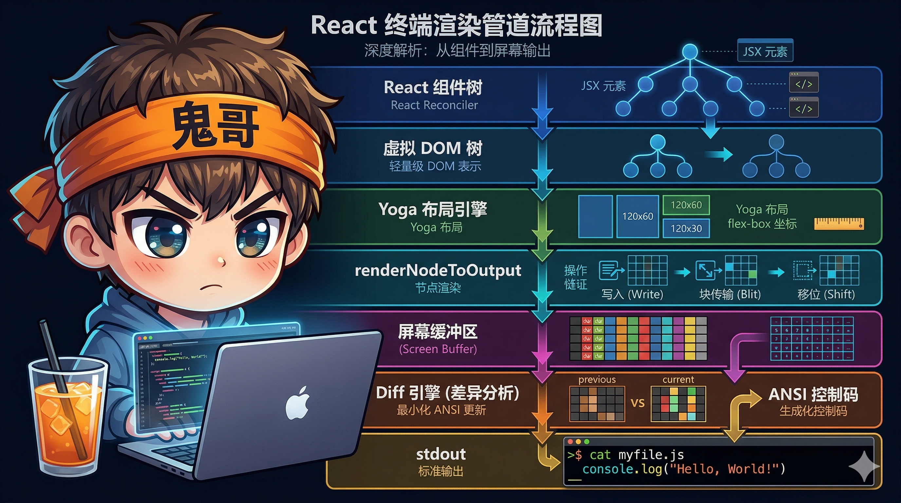
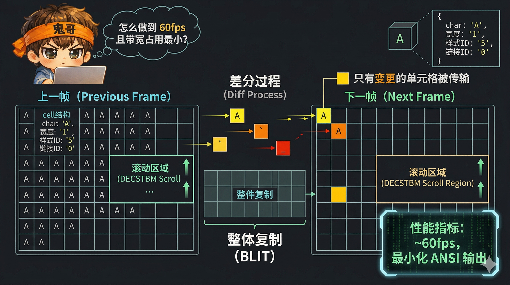

# 解剖 Claude Code（九）：在终端里造一个浏览器——自定义 Ink 渲染引擎

> 终端不是浏览器——没有 DOM、没有 CSS、没有 GPU 加速。但 Claude Code 却在终端里实现了一套完整的渲染管线：**自定义 React Reconciler → 终端 DOM → Yoga Flexbox 布局 → 打包屏幕缓冲区 → 损伤矩形 Diff → ANSI 输出**。这套系统以 ~60fps 的帧率、192KB 的内存占用（200×120 屏幕），在纯文本终端中实现了滚动、裁剪、超链接、流式渲染等浏览器级别的 UI 能力。


<!-- IMG_09_COVER -->

---

## 问题

传统 CLI 工具的 UI 模式很简单：`console.log()` 打印一行，光标往下走一行。但 Claude Code 需要的远不止于此：

1. **Flexbox 布局**：工具面板、状态栏、聊天窗口需要弹性排列
2. **滚动容器**：对话历史可能有上千行，需要虚拟滚动和裁剪
3. **增量更新**：流式生成文本时不能每次全屏重绘——闪烁且慢
4. **样式系统**：语法高亮、选中态、超链接需要精确的 ANSI 样式管理
5. **声明式 UI**：用 React 组件描述 UI，而不是手动拼 ANSI 转义序列

Claude Code 的解法是**在终端里造一个浏览器**：用 React 管理组件树，用 Yoga 算布局，用 Int32Array 当帧缓冲区，用损伤矩形做增量 diff，用 DECSTBM 做硬件滚动。

---

## 在整体架构中的位置

```
React 组件树
   │
   ▼
自定义 Reconciler（react-reconciler）
   │
   ▼
终端 DOM 树（DOMElement / TextNode）
   │
   ▼
Yoga Flexbox 布局引擎
   │
   ▼
renderNodeToOutput → 操作队列（write/blit/shift/clip/clear）
   │
   ▼
Screen Buffer（Int32Array，2 word/cell）
   │
   ▼
diffEach → 损伤矩形 Diff
   │
   ▼
Patch[] → ANSI 转义序列 → stdout
```

这就是一个微型的浏览器渲染管线。每一层对应浏览器中的一个概念：Reconciler = React DOM、终端 DOM = HTML DOM、Yoga = CSS Layout、Screen Buffer = Frame Buffer、diffEach = Compositor。

---

## Part 1：自定义 React Reconciler

### 为什么不用 React DOM？

React DOM 生成 HTML 元素，但终端没有 HTML。Claude Code 用 `react-reconciler` 包创建了一个**自定义宿主环境**——React 只管组件树的 diff 和调度，宿主环境决定"元素"到底是什么。

**文件**：`src/ink/reconciler.ts`

```typescript
// 泛型参数定义了整个宿主环境的类型
createReconciler<
  ElementNames,     // 元素类型：'ink-box' | 'ink-text' | ...
  Props,            // 属性类型
  DOMElement,       // 容器类型
  DOMElement,       // 实例类型
  TextNode,         // 文本节点类型
  ...
>
```

### 关键 HostConfig 方法

| 方法 | 作用 | 浏览器类比 |
|------|------|-----------|
| `createInstance` | 创建 DOMElement 节点 | `document.createElement()` |
| `createTextInstance` | 创建 TextNode | `document.createTextNode()` |
| `appendChild` | 添加子节点 | `parent.appendChild(child)` |
| `commitUpdate` | 更新节点属性 | `element.setAttribute()` |
| `commitTextUpdate` | 更新文本内容 | `textNode.nodeValue = ...` |
| `resetAfterCommit` | **触发渲染管线** | 浏览器的 Layout + Paint |

`resetAfterCommit` 是整条管线的触发点：

```typescript
resetAfterCommit(rootNode) {
  // 1. 触发 Yoga 布局
  rootNode.onComputeLayout()
  // 2. 触发屏幕渲染（节流到 ~60fps）
  rootNode.onRender()
}
```

### ConcurrentRoot 模式

```typescript
import { ConcurrentRoot } from 'react-reconciler/constants.js'

this.container = reconciler.createContainer(
  this.rootNode,
  ConcurrentRoot,  // 启用并发模式
  ...
)
```

ConcurrentRoot 让 React 可以区分**离散事件**（键盘/点击 → 同步处理）和**连续事件**（滚动/调整大小 → 可中断），确保键盘输入永远不会被滚动更新阻塞。

### 上下文追踪：isInsideText

```typescript
getRootHostContext() {
  return { isInsideText: false }
}

getChildHostContext(parentContext, type) {
  if (type === 'ink-text' || type === 'ink-virtual-text' || type === 'ink-link') {
    return { isInsideText: true }
  }
  return parentContext
}
```

当 `isInsideText` 为 true 时，`ink-text` 自动降级为 `ink-virtual-text`（不创建 Yoga 节点），避免文本内部的嵌套布局计算。

---

## Part 2：终端 DOM

React Reconciler 操作的不是 HTML 元素，而是一套**终端专用的 DOM 类型**。

**文件**：`src/ink/dom.ts`

### DOMElement 类型

```typescript
type DOMElement = {
  nodeName: ElementNames          // 元素类型
  attributes: Record<string, DOMNodeAttribute>
  childNodes: DOMNode[]           // 子节点数组
  textStyles?: TextStyles         // 文本样式（颜色/粗体等）

  // Yoga 布局
  yogaNode?: LayoutNode           // Flexbox 布局节点

  // 渲染控制
  dirty: boolean                  // 脏标记
  isHidden?: boolean              // 隐藏/显示

  // 滚动状态
  scrollTop?: number
  pendingScrollDelta?: number
  scrollHeight?: number
  scrollViewportHeight?: number

  // 渲染回调
  onComputeLayout?: () => void
  onRender?: () => void
}
```

### 七种元素类型

| 类型 | 有 Yoga 节点 | 用途 |
|------|:---:|------|
| `ink-root` | ✅ | 根容器 |
| `ink-box` | ✅ | Flexbox 容器（类似 `<div>`） |
| `ink-text` | ✅ | 文本容器（类似 `<span>`） |
| `ink-virtual-text` | ❌ | 嵌套文本（无独立布局） |
| `ink-link` | ❌ | 超链接 |
| `ink-progress` | ❌ | 进度条 |
| `ink-raw-ansi` | ✅ | 预渲染 ANSI 字符串 |

### Yoga 节点绑定

```typescript
const createNode = (nodeName: ElementNames): DOMElement => {
  const needsYogaNode =
    nodeName !== 'ink-virtual-text' &&
    nodeName !== 'ink-link' &&
    nodeName !== 'ink-progress'

  const node: DOMElement = {
    nodeName,
    yogaNode: needsYogaNode ? createLayoutNode() : undefined,
    ...
  }

  // 文本节点注册测量函数
  if (nodeName === 'ink-text') {
    node.yogaNode?.setMeasureFunc(measureTextNode.bind(null, node))
  }
}
```

只有需要参与布局计算的元素才创建 Yoga 节点——`ink-virtual-text`、`ink-link`、`ink-progress` 不参与布局，节省内存和计算。

### markDirty：从叶子到根的脏传播

```typescript
const markDirty = (node?: DOMNode): void => {
  let current = node
  let markedYoga = false

  while (current) {
    if (current.nodeName !== '#text') {
      current.dirty = true
      // 只在文本叶子节点标记 Yoga 脏（触发重新测量）
      if (!markedYoga &&
          (current.nodeName === 'ink-text' || current.nodeName === 'ink-raw-ansi') &&
          current.yogaNode) {
        current.yogaNode.markDirty()
        markedYoga = true
      }
    }
    current = current.parentNode
  }
}
```

关键设计：**Yoga 脏标记只打在文本叶子节点上**。因为 Yoga 只在叶子节点有测量函数——标记非叶子节点会触发不必要的级联重算。DOM 的 `dirty` 标志则一路传播到根，用于后续的渲染管线判断哪些子树需要重绘。

---

## Part 3：Yoga Flexbox 布局

终端的行列模型天然适合 Flexbox——每个字符是一个 1×1 的像素。

**文件**：`src/ink/layout/yoga.ts`、`src/ink/layout/node.ts`

### CSS 到 Yoga 的映射

```
React 组件 props:
  <Box flexDirection="row" padding={1} gap={2}>
    <Text wrap="wrap">Hello World</Text>
  </Box>

         ↓ applyStyles()

Yoga 节点属性:
  yogaNode.setFlexDirection(FlexDirection.Row)
  yogaNode.setPadding(Edge.All, 1)
  yogaNode.setGap(Gutter.Column, 2)
```

支持的 CSS 属性包括：flexDirection、flexGrow/Shrink/Basis、justifyContent、alignItems/Self、flexWrap、overflow（visible/hidden/scroll）、position（relative/absolute）、margin/padding/border、gap、width/height 及 min/max 变体。

### 文本测量函数

Yoga 在布局时需要知道文本节点的**固有尺寸**——这通过测量函数实现：

```typescript
const measureTextNode = (node, width, widthMode) => {
  const text = squashTextNodes(node)     // 递归收集子文本
  const expanded = expandTabs(text)       // Tab → 空格

  let dimensions = measureText(expanded, width)
  if (dimensions.width <= width) return dimensions  // 不需要换行

  // 需要换行
  const textWrap = node.style?.textWrap ?? 'wrap'
  const wrappedText = wrapText(expanded, width, textWrap)
  return measureText(wrappedText, width)
}
```

五种换行策略：`wrap`（硬换行）、`wrap-trim`（换行+去尾空格）、`truncate-end`（末尾省略号）、`truncate-middle`（中间省略号）、`truncate-start`（开头省略号）。

### 布局触发时机

```typescript
// ink.tsx - 注册到根节点
this.rootNode.onComputeLayout = () => {
  this.rootNode.yogaNode.setWidth(this.terminalColumns)
  this.rootNode.yogaNode.calculateLayout(this.terminalColumns)
}
```

布局在 React 的 commit 阶段触发（`resetAfterCommit`），但在 `useLayoutEffect` 之前完成——确保 layout effect 读到的尺寸是最新的。

---

## Part 4：打包屏幕缓冲区与三级 Intern Pool

这是整个渲染引擎中最底层、也是性能最关键的部分。

**文件**：`src/ink/screen.ts`

### 为什么不用对象数组？

一个 200×120 的终端有 24,000 个 cell。如果每个 cell 是一个 JS 对象：

```javascript
// 朴素方案：每个 cell 一个对象
{ char: 'A', fg: 'blue', bg: 'black', bold: true, hyperlink: '...' }
// 24,000 个对象 × ~100 bytes ≈ 2-3 MB，GC 压力巨大
```

Claude Code 的方案：**2 个 Int32 打包一个 cell**。

### 打包格式

```
每个 cell = 2 个连续的 Int32（8 字节）

word0: charId        ← 32-bit，CharPool 索引
word1: styleId[31:17] | hyperlinkId[16:2] | width[1:0]
       ├─ 15 bit styleId     ← StylePool 索引
       ├─ 15 bit hyperlinkId ← HyperlinkPool 索引
       └──  2 bit width      ← CellWidth 枚举
```

```typescript
// 位操作常量
const STYLE_SHIFT = 17
const HYPERLINK_SHIFT = 2
const HYPERLINK_MASK = 0x7fff   // 15 bits
const WIDTH_MASK = 3             // 2 bits

// CellWidth 枚举
Narrow = 0      // 普通字符（宽度 1）
Wide = 1        // CJK/Emoji（宽度 2）
SpacerTail = 2  // 宽字符的第 2 格（不渲染）
SpacerHead = 3  // 行末宽字符的占位符（防止换行）
```

**内存效果**：24,000 cells × 8 bytes = **192 KB**。对比对象方案节省 10-15 倍内存，且完全没有 GC 压力。

### 双视图共享 ArrayBuffer

```typescript
type Screen = Size & {
  cells: Int32Array        // 逐 word 读写
  cells64: BigInt64Array   // 批量填充（clearRegion 用 fill(0n)）
  charPool: CharPool
  hyperlinkPool: HyperlinkPool
  emptyStyleId: number
  damage: Rectangle | undefined   // 损伤矩形
  noSelect: Uint8Array            // 每 cell 的选择排除标记
  softWrap: Int32Array            // 每行的软换行标记
}
```

`cells` 和 `cells64` 共享同一个 `ArrayBuffer`——用 `Int32Array` 做逐 cell 操作，用 `BigInt64Array` 做批量清除（`cells64.fill(0n)` 一条指令清空整个区域）。

### 三级 Intern Pool

**CharPool**——字符串驻留：

```typescript
class CharPool {
  private asciiLut = new Int32Array(128)  // ASCII 快速路径
  private map = new Map<string, number>() // 非 ASCII
  private chars: string[] = []

  intern(char: string): number {
    // ASCII: 直接数组查找，O(1)
    const code = char.charCodeAt(0)
    if (char.length === 1 && code < 128) {
      let id = this.asciiLut[code]
      if (id !== -1) return id
      id = this.chars.length
      this.chars.push(char)
      this.asciiLut[code] = id
      return id
    }
    // 非 ASCII: Map 查找
    let id = this.map.get(char)
    if (id === undefined) {
      id = this.chars.length
      this.chars.push(char)
      this.map.set(char, id)
    }
    return id
  }
}
```

预初始化：index 0 = `' '`（空格），index 1 = `''`（宽字符占位符）。

**StylePool**——样式驻留：

```typescript
class StylePool {
  private ids = new Map<string, number>()
  private styles: AnsiCode[][] = []
  private transitionCache = new Map<number, string>()

  intern(styles: AnsiCode[]): number {
    const key = styles.map(s => s.code).join('\0')
    let id = this.ids.get(key)
    if (id === undefined) {
      const rawId = this.styles.length
      this.styles.push(styles)
      // Bit 0 = 可见性标志（是否影响空格渲染）
      id = (rawId << 1) | (hasVisibleSpaceEffect(styles) ? 1 : 0)
      this.ids.set(key, id)
    }
    return id
  }

  // 缓存样式转换的 ANSI 序列
  transition(fromId: number, toId: number): string {
    if (fromId === toId) return ''
    const key = fromId * 0x100000 + toId
    let str = this.transitionCache.get(key)
    if (str === undefined) {
      str = ansiCodesToString(diffAnsiCodes(this.get(fromId), this.get(toId)))
      this.transitionCache.set(key, str)
    }
    return str
  }
}
```

两个精巧设计：
- **Bit 0 编码可见性**：奇数 styleId = 有背景色/下划线/反色（空格也需要渲染），偶数 = 纯前景色（空格可跳过）。Diff 时用 `id & 1` 判断空 cell 是否需要输出。
- **转换缓存**：`transition(fromId, toId)` 缓存两个样式之间的 ANSI 差异序列。例如从"蓝色粗体"到"红色普通"只需 `\e[22;31m` 而不是 `\e[0m\e[31m`。稳态帧完全零分配。

**HyperlinkPool**——URL 驻留：
- Index 0 = 无超链接
- URL → ID 映射，每 5 分钟重置（防止泄漏）


<!-- IMG_09_INCREMENTAL_RENDER -->

---

## Part 5：渲染管线——从 DOM 树到屏幕缓冲区

**文件**：`src/ink/render-node-to-output.ts`、`src/ink/output.ts`、`src/ink/renderer.ts`

### 操作队列

渲染管线不直接写屏幕缓冲区，而是生成一个**操作队列**：

```typescript
type Operation =
  | WriteOperation      // 写入文本（含样式）
  | BlitOperation       // 从上一帧复制矩形区域
  | ShiftOperation      // DECSTBM 硬件滚动
  | ClearOperation      // 清空矩形区域
  | ClipOperation       // 设置裁剪区域
  | UnclipOperation     // 取消裁剪
  | NoSelectOperation   // 标记不可选中
```

### Blit 优化：未变子树的零成本复制

```typescript
// render-node-to-output.ts
if (!node.dirty && cached &&
    cached.x === x && cached.y === y &&
    cached.width === width && cached.height === height) {
  // 内容没变 + 位置没变 → 直接从上一帧复制
  output.blit(prevScreen, x, y, width, height)
  return  // 跳过整个子树
}
```

如果一个节点及其所有子节点都没变化，渲染管线直接从上一帧的屏幕缓冲区**复制矩形区域**到新帧。这是最重要的性能优化——大多数帧只有少量节点变化。

`blitRegion` 的实现利用 `TypedArray.set()` 批量拷贝：
- **全宽连续行**：单次 `set()` 调用
- **部分宽度行**：逐行 `set()` 调用
- **宽字符边界**：自动处理 SpacerTail 断裂

### 操作物化：Output.get()

操作队列最终物化到屏幕缓冲区：

```
1. 处理 clear 操作 → 标记损伤区域
2. 处理 blit 操作 → TypedArray.set() 批量复制
3. 处理 shift 操作 → 模拟硬件滚动
4. 处理 write 操作 → 逐字符写入 cell
5. 处理 noSelect 操作 → 标记不可选中区域
```

### charCache：行级缓存

写操作中最昂贵的是**字素聚类**（grapheme clustering）——将 ANSI 转义序列和 Unicode 组合字符拆分为独立的渲染单元。charCache 按行文本缓存聚类结果：

```typescript
// 缓存键 = 行文本，值 = ClusteredChar[]
private charCache = new Map<string, ClusteredChar[]>()

// 大多数行在帧间不变 → 命中缓存
if (this.charCache.size > 16384) this.charCache.clear()
```

---

## Part 6：损伤矩形 Diff

**文件**：`src/ink/screen.ts`（diffEach）

### 核心思路

不是逐 cell 比较两帧的所有 24,000 个 cell，而是：

1. **追踪损伤矩形**：每次写入/清除都扩展损伤矩形的边界
2. **只 diff 损伤区域内的 cell**：未变区域直接跳过
3. **用 findNextDiff 跳过连续相同 cell**

### findNextDiff：JIT 友好的热循环

```typescript
function findNextDiff(
  a: Int32Array, b: Int32Array,
  w0: number,    // 起始 word 索引
  count: number  // 最大 cell 数
): number {
  for (let i = 0; i < count; i++, w0 += 2) {
    const w1 = w0 | 1
    if (a[w0] !== b[w0] || a[w1] !== b[w1]) return i
  }
  return count
}
```

这个函数是整个 diff 引擎的最内层循环。设计要点：
- **无分配**：纯整数比较，无对象创建
- **最少分支**：每次迭代只有一个条件判断
- **JIT 友好**：TypedArray 的整数索引访问是 V8 最擅长优化的模式
- **2-word 比较**：`w0 | 1` 用位运算获取 word1 索引（比 `w0 + 1` 更快）

### diffEach 流程

```typescript
function diffEach(prev: Screen, next: Screen, callback): boolean {
  // 1. 合并两帧的损伤矩形
  const damage = unionRect(prev.damage, next.damage)

  // 2. 如果屏幕尺寸变了，扩展扫描范围
  if (prev.width !== next.width) → diffDifferentWidth()
  else → diffSameWidth()

  // 3. 对每一行：
  //    - 两帧都有 → diffRowBoth()（用 findNextDiff 跳过相同 cell）
  //    - 只有上一帧 → diffRowRemoved()（高度缩小了）
  //    - 只有下一帧 → diffRowAdded()（高度增大了）
}
```

Callback 类型：`(x, y, removed?, added?) => boolean | void`。返回 `true` 提前终止（用于检测滚动区之外的变化时快速退出）。

---

## Part 7：终端输出——ANSI 序列与硬件滚动

**文件**：`src/ink/log-update.ts`、`src/ink/termio/csi.ts`

### Patch 类型

diff 的结果是一组 Patch，对应不同的终端操作：

```typescript
type Patch =
  | { type: 'stdout'; content: string }     // 原始 ANSI/文本
  | { type: 'styleStr'; str: string }        // SGR 样式转换（缓存的）
  | { type: 'cursorMove'; x: number; y: number }  // 相对光标移动
  | { type: 'cursorTo'; col: number }        // 绝对列移动（CHA）
  | { type: 'hyperlink'; uri: string }       // OSC 8 超链接
  | { type: 'clear'; count: number }         // 擦除行
  | { type: 'carriageReturn' }               // 回车
  | { type: 'cursorHide' | 'cursorShow' }    // 光标显隐
```

### DECSTBM 硬件滚动

当 ScrollBox 内容滚动时，不需要重绘所有行。终端有硬件滚动支持：

```typescript
if (altScreen && next.scrollHint && decstbmSafe) {
  const { top, bottom, delta } = next.scrollHint

  scrollPatch = [
    {
      type: 'stdout',
      content:
        setScrollRegion(top + 1, bottom + 1) +  // CSI top;bottom r（设置滚动区）
        (delta > 0
          ? csiScrollUp(delta)     // CSI n S（向上滚动 n 行）
          : csiScrollDown(-delta)  // CSI n T（向下滚动 n 行）
        ) +
        RESET_SCROLL_REGION +      // CSI r（重置滚动区）
        CURSOR_HOME                // CSI H（光标回原点）
    }
  ]
}
```

终端硬件滚动意味着操作系统直接移动显存中的行数据——无需通过 stdout 传输那些行的内容。然后 diff 引擎只需要处理滚动进来的新行。

### 光标移动优化

```typescript
// VirtualScreen 追踪逻辑光标位置
class VirtualScreen {
  cursor: Point
  diff: Diff = []

  // 事务性光标操作
  txn(fn: (prev: Point) => [patches: Diff, next: Delta]): void
}
```

光标移动策略：
- **同行移动**：`CSI dx C`（一条指令）
- **跨行移动**：`CR + CSI row;col H`（回车 + 绝对定位）
- **Pending Wrap 检测**：光标在行末时先 `CR` 重置，避免意外换行
- **用 LF 而非 CSI CUD**：LF 在到达底部时会滚动视口创建新行，而 `CSI B` 会停在底部

### 宽字符补偿

终端的 wcwidth 表可能与 Unicode 标准不同步：

```typescript
function needsWidthCompensation(char: string): boolean {
  // 类型 1：新 Emoji（Unicode 12.0+），终端 wcwidth 表还没收录
  // U+1FA70-U+1FAFF, U+1FB00-U+1FBFF
  
  // 类型 2：文本默认 + VS16（U+FE0F）的 Emoji
  // wcwidth 认为宽度 1，但 VS16 让它变成宽度 2
  // 例如：⚔️ (U+2694), ☠️ (U+2620), ❤️ (U+2764)
}
```

补偿方法：写入 Emoji 后用 `cursorTo` 强制光标到正确位置，抵消 wcwidth 误差。

---

## Part 8：ScrollBox 三阶段渲染

**文件**：`src/ink/components/ScrollBox.tsx`、`src/ink/render-node-to-output.ts`

ScrollBox 是终端渲染中最复杂的组件——它需要在固定高度的视口中显示任意长度的内容，支持平滑滚动和虚拟化。

### ScrollBox API

```typescript
type ScrollBoxHandle = {
  scrollTo(y: number): void
  scrollBy(dy: number): void
  scrollToElement(el: DOMElement, offset?: number): void
  scrollToBottom(): void

  getScrollTop(): number
  getScrollHeight(): number
  getViewportHeight(): number
  isSticky(): boolean              // 是否固定在底部
  setClampBounds(min?, max?): void // 虚拟滚动范围
}
```

### 三阶段渲染

当 ScrollBox 的 scrollTop 变化时，渲染管线执行三阶段优化：

**阶段一：Blit + Shift（快速路径）**

```
前提：纯滚动（内容高度不变，scrollTop 变化量 < 视口高度）

1. 从上一帧 blit 整个滚动区域
2. 发出 shift 操作 → 终端硬件滚动（DECSTBM）
3. 效果：大部分行由终端硬件移动，无需传输
```

**阶段二：边缘渲染**

```
滚动后，视口边缘出现了新行：
- 向下滚动 → 底部出现新行
- 向上滚动 → 顶部出现新行

1. 清除边缘行
2. 只渲染与边缘区域相交的子节点
3. 裁剪：完全在非边缘区域内的子节点跳过
```

**阶段三：修复绝对定位覆盖层**

```
问题：绝对定位元素（如自动补全菜单）在上一帧画在 ScrollBox 上面。
      硬件滚动移动了它们的像素，但没有移动它们的逻辑位置。

解法：在新帧中重新渲染所有绝对定位后代。
```

**退化为全量渲染的条件**：
- 大幅跳跃（scrollTop 变化 ≥ 视口高度）
- 子节点增删
- 容器移动

### 虚拟滚动裁剪

对于上千行的对话历史，ScrollBox 配合虚拟化使用：

```typescript
// 视口裁剪：跳过不可见的子节点
const visible = scrollTop → scrollTop + viewportHeight

for (child of children) {
  const childTop = child.yogaNode.getComputedTop()
  const childBottom = childTop + child.yogaNode.getComputedHeight()

  if (childBottom <= scrollTop) continue   // 在视口上方 → 跳过
  if (childTop >= scrollTop + viewportHeight) continue  // 在视口下方 → 跳过

  renderChild(child)
}
```

渲染时间与**可见内容量**成正比，而非总内容量。

---

## Part 9：帧调度与双缓冲

**文件**：`src/ink/ink.tsx`

### 双缓冲

```typescript
class Ink {
  private frontFrame: Frame    // 当前显示的帧
  private backFrame: Frame     // 上一帧（用于 diff）

  onRender() {
    const frame = this.renderer({
      frontFrame: this.frontFrame,
      backFrame: this.backFrame,
      ...
    })
    // 交换缓冲区
    this.backFrame = this.frontFrame
    this.frontFrame = frame
    // diff + 输出
    this.logUpdate.render(this.backFrame, this.frontFrame)
  }
}
```

### 帧节流

```typescript
const FRAME_INTERVAL_MS = 16  // ~60fps

const deferredRender = () => queueMicrotask(this.onRender)
this.scheduleRender = throttle(deferredRender, FRAME_INTERVAL_MS, {
  leading: true,   // 第一次变化立即渲染
  trailing: true   // 最后一次变化也保证渲染
})
```

为什么用 `queueMicrotask` 再包一层？

React 的 `resetAfterCommit` 在 commit 阶段调用，但 `useLayoutEffect` 还没执行。如果直接渲染，effect 中声明的光标位置还没更新。`queueMicrotask` 将渲染推迟到 microtask 队列——在 layout effect 之后、下一个宏任务之前执行。

### 事件优先级

```typescript
function getEventPriority(eventType: string): number {
  switch (eventType) {
    case 'keydown':
    case 'click':
    case 'focus':
      return DiscreteEventPriority    // 同步，最高优先级
    case 'resize':
    case 'scroll':
      return ContinuousEventPriority  // 可中断
    default:
      return DefaultEventPriority
  }
}
```

键盘输入 → 同步处理 → 立即渲染。滚动/调整大小 → 可中断 → 不阻塞输入响应。这保证了即使在高频滚动时，用户的按键也能立即反馈。

---

## 完整渲染流程

```
ink.render(<ChatUI />) ─────────────────────────────────────────────┐
                                                                     │
  1. reconciler.updateContainerSync()                                │
     └─ React 协调 → createInstance / commitUpdate                  │
                                                                     │
  2. reconciler.resetAfterCommit()                                   │
     ├─ rootNode.onComputeLayout()                                  │
     │   └─ yoga.calculateLayout(terminalColumns)                   │
     │       └─ measureTextNode() → wrapText() → { width, height } │
     └─ rootNode.onRender() → scheduleRender()                     │
         └─ throttle(16ms) → queueMicrotask                        │
                                                                     │
  3. onRender()（microtask）                                         │
     ├─ renderer()                                                   │
     │   └─ renderNodeToOutput(rootNode, output)                    │
     │       ├─ 干净节点 → blit(prevScreen)                         │
     │       ├─ 脏节点 → write(text, styles)                       │
     │       └─ ScrollBox → shift + edge render + overlay repair    │
     ├─ output.get() → Screen（Int32Array）                         │
     ├─ swap(frontFrame, backFrame)                                  │
     └─ logUpdate.render(back, front)                                │
         ├─ diffEach(prev.screen, next.screen, callback)            │
         │   └─ findNextDiff() → 跳过相同 cell                     │
         ├─ stylePool.transition(fromId, toId) → 缓存 ANSI 序列    │
         ├─ DECSTBM 硬件滚动                                        │
         └─ Patch[] → stdout                                        │
```

---

## 为什么这样设计

### 1. Int32Array 而非对象数组

终端渲染是 **CPU-bound 热循环**——每帧需要读写数万个 cell。JS 对象数组的问题不只是内存，更是 GC。每次 GC 暂停都是一帧的卡顿。TypedArray 是 GC 不可见的连续内存，V8 可以直接 JIT 为接近原生的机器码。

### 2. 损伤矩形而非全帧 Diff

全帧 diff 是 O(width × height)。损伤矩形将扫描范围限制在实际变化的区域内。对于流式文本输出（最常见的场景），通常只有最后几行变化——损伤矩形把 diff 从 24,000 cell 降到几百 cell。

### 3. 三级 Intern Pool 的必要性

同一个字符、同一组样式在屏幕上会出现成百上千次。Intern 将它们映射为整数 ID，带来三个好处：
- **打包存储**：cell 只需存 ID 而非字符串引用
- **O(1) 比较**：`styleIdA === styleIdB` 替代 `deepEqual(styleA, styleB)`
- **缓存友好**：ID → ANSI 序列的转换可缓存

### 4. DECSTBM 硬件滚动

软件滚动 = 重绘所有行。硬件滚动 = 一条 CSI 指令让终端移动显存。在 SSH 连接中，这意味着节省了数 KB 的 stdout 传输——延迟差异在高延迟网络下尤为明显。

### 5. queueMicrotask 的精确时机

渲染太早（commit 阶段）→ layout effect 还没执行，光标位置不对。渲染太晚（setTimeout）→ 用户感知到延迟。`queueMicrotask` 恰好在两者之间——layout effect 之后、下一个事件循环之前。

---

## 可借鉴的模式

### 模式一：TypedArray 打包缓冲区

```
规则：对高频读写的同构数据，用 TypedArray 替代对象数组。
实现：2 个 Int32 = 1 个 cell，位运算打包/解包。
适用场景：任何需要在 JS 中处理大量同构数据的场景——
         游戏引擎的粒子系统、音频处理的采样缓冲区、
         数据可视化的像素缓冲区。
```

### 模式二：Intern Pool + 缓存转换

```
规则：重复出现的值驻留为整数 ID，缓存 ID 对之间的转换。
实现：StylePool.intern() → ID，transition(from, to) → 缓存 ANSI。
适用场景：需要频繁比较或转换重复值的系统——
         CSS-in-JS 的样式去重、编译器的字符串驻留。
```

### 模式三：损伤矩形增量更新

```
规则：记录变化区域的包围盒，只处理损伤区域。
实现：每次写入扩展 damage rect，diffEach 只扫描 damage 范围。
适用场景：任何二维渲染系统的增量更新——
         桌面窗口管理器、地图瓦片渲染、电子表格。
```

### 模式四：硬件能力探测与优雅退化

```
规则：检测终端/环境的能力，有则用硬件加速，无则回退软件实现。
实现：Alt Screen → DECSTBM 硬件滚动；无 Alt Screen → 软件重绘。
适用场景：任何需要适配不同终端/浏览器/设备能力的系统。
```

---

## 下一篇预告

渲染管线解决了"如何画"的问题。但 Claude Code 不只运行在终端里——它还运行在 VS Code 扩展、Web 界面、甚至移动端。一个 Claude 实例如何同时服务多个前端？下一篇，我们拆解 **Bridge 与协议层**——让多端共享一个 Agent 的通信架构。

---

| 篇 | 标题 | 状态 |
|----|------|------|
| [01](/part1-foundation/ch01-architecture) | 512K 行代码，一个终端里的 Agent Runtime | ✅ |
| [02](/part1-foundation/ch02-react-loop) | ReAct 循环：`while(true)` 里的五个阶段与七层恢复 | ✅ |
| [03](/part1-foundation/ch03-cache-compression) | Prompt 缓存分割与四级上下文压缩 | ✅ |
| [04](/part2-core/ch04-tool-system) | 50 个工具的统一契约：Tool System 设计 | ✅ |
| [05](/part2-core/ch05-memory) | 五层记忆体系：从短期到持久化 | ✅ |
| [06](/part2-core/ch06-security) | 纵深防御：23 项安全检查与"不信任任何输入" | ✅ |
| [07](/part3-performance/ch07-speculation-state) | 投机执行与自研状态管理：隐藏延迟的两个利器 | ✅ |
| [08](/part3-performance/ch08-multi-agent) | 多 Agent 编排：三种执行模型与 Coordinator 模式 | ✅ |
| **09** | **在终端里造一个浏览器：自定义 Ink 渲染引擎**（本篇） | ✅ |
| 10 | Bridge 与协议层：让 VS Code、Web、Mobile 共享一个 Claude | 🔄 下一篇 |
| 11 | Skill、Plugin、Hook：三层扩展的设计谱系 | ⬚ |
| 12 | 回顾：从 Claude Code 中提炼的 10 个 Agent 工程模式 | ⬚ |
