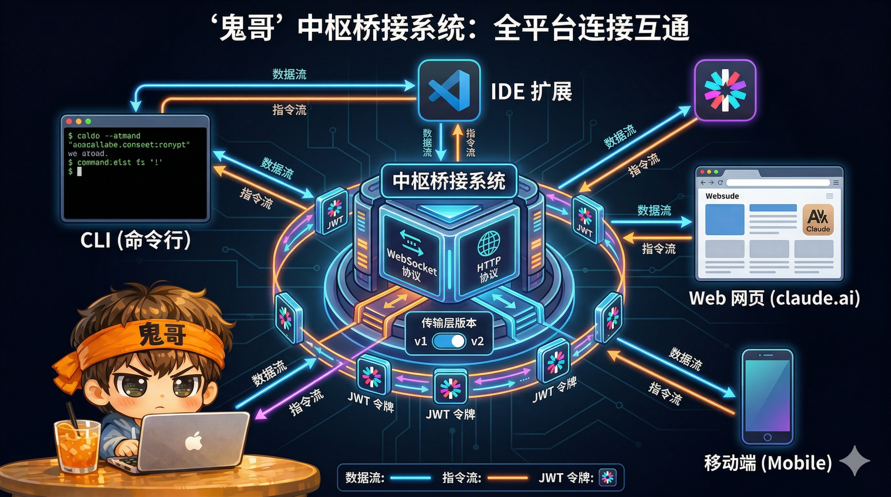

# 解剖 Claude Code（十）：Bridge 与协议层——让 VS Code、Web、Mobile 共享一个 Claude

> Claude Code 不只运行在终端里——它还运行在 VS Code、JetBrains、桌面应用、Web 界面、甚至移动端。一个 Agent 实例如何同时服务多个前端？答案是 **Bridge 协议层**：一套基于 NDJSON 的双向消息协议，通过可插拔的传输层（WebSocket / SSE+HTTP / Unix Socket），在本地 CLI 进程与远端 UI 之间建立实时通道。消息去重、断线续传、权限委托、会话持久化——Bridge 把"多端共享一个 Agent"从概念变成了工程现实。


<!-- IMG_10_COVER -->

---

## 问题

Claude Code 最初是一个纯终端应用——用 Ink 渲染 UI，用 stdin/stdout 交互。但用户场景远不止终端：

1. **IDE 集成**：在 VS Code 或 JetBrains 里用 Webview 面板与 Claude 对话，同时操作编辑器
2. **Web 界面**：通过 claude.ai/code 远程连接到本地开发环境中运行的 Claude Code
3. **桌面应用**：从终端会话无缝切换到 Claude Desktop 继续对话
4. **移动端**：在手机上查看和控制正在运行的 Agent

这些场景需要解决四个核心问题：

- **渲染解耦**：终端用 ANSI，IDE 用 Webview，Web 用 HTML——Agent 逻辑不能绑定渲染层
- **实时同步**：多个前端看到同一个对话流，包括流式输出和工具进度
- **权限委托**：工具需要用户批准时，请求必须跨进程到达 UI，响应必须传回 Agent
- **断线恢复**：网络抖动不能丢失消息，进程崩溃后能恢复会话

---

## 在整体架构中的位置

```
                    ┌──────────────────────┐
                    │   Core Agent Loop    │
                    │  (渲染无关的核心)     │
                    └──────────┬───────────┘
                               │ AppState + Callbacks
              ┌────────────────┼────────────────┐
              ↓                ↓                ↓
        ┌──────────┐    ┌──────────┐    ┌──────────┐
        │ Terminal  │    │  Bridge  │    │  Direct  │
        │  (Ink)   │    │ Protocol │    │ Connect  │
        └──────────┘    └────┬─────┘    └────┬─────┘
                             │               │
                    ┌────────┼────────┐      │
                    ↓        ↓        ↓      ↓
                claude.ai  Mobile  Desktop  VS Code
                 (Web)     (App)   (App)   JetBrains
```

Agent 核心只关心一件事：处理用户消息、调用工具、生成回复。**怎么送达**是 Bridge 和传输层的责任。

---

## Part 1：渲染无关的核心

在 Bridge 架构中，最重要的设计决策是**Agent 核心与渲染层彻底分离**。

### 核心抽象

```typescript
// 前端无关的渲染接口
type Root = {
  render(component: React.ReactNode): Promise<void>
  cleanup(): Promise<void>
}

// 不同前端提供不同实现：
// Terminal → Ink Renderer（ANSI 输出）
// VS Code  → Webview Panel（HTML）
// Web      → 无本地渲染（通过 Bridge 转发）
```

核心 Agent 循环（`main.tsx`）通过 `AppState` 和回调函数驱动：

```
用户消息进入
   ↓
Agent Loop 处理（模型调用、工具执行）
   ↓
AppState 更新（消息历史、工具状态、权限请求）
   ↓
前端订阅者收到通知 → 各自渲染
```

这个分离使得同一个 Agent 实例可以同时被终端 Ink 渲染器和远程 Bridge 客户端消费——它们只是 AppState 的不同订阅者。

---

## Part 2：Bridge 协议——消息类型与格式

### 传输格式：NDJSON

Bridge 使用 **Newline-Delimited JSON** 作为线路格式——每条消息是一行 JSON：

```
{"type":"assistant","message":{"role":"assistant","content":[...]},"uuid":"msg-001","session_id":"ses-abc"}\n
{"type":"tool_progress","tool_use_id":"tu-01","tool_name":"Read","elapsed_time_seconds":0.3}\n
{"type":"control_request","request_id":"req-01","request":{"subtype":"can_use_tool",...}}\n
```

为什么不用 Protobuf 或 MessagePack？因为 **可调试性**——`console.log` 就能看到消息内容，`jq` 就能过滤，日志系统天然支持。对于 Claude Code 的消息量级（每秒几十条而非几万条），序列化开销不是瓶颈。

### 消息类型体系

**Server → Client（Agent 向前端推送）**

| 类型 | 用途 | 频率 |
|------|------|------|
| `assistant` | 完整的助手回复 | 每轮一次 |
| `stream_event` | 流式 Token（包装 Claude API 的 StreamEvent） | 高频 |
| `tool_use_summary` | 工具执行摘要 | 每次工具调用 |
| `tool_progress` | 工具执行进度（耗时、活动） | 周期性 |
| `system` | 系统事件（压缩边界、状态变更） | 偶尔 |
| `result` | 会话完成（用量、成本、权限拒绝统计） | 每轮结束 |
| `rate_limit_event` | 速率限制状态 | 偶尔 |
| `auth_status` | 认证状态变更 | 偶尔 |
| `control_request` | 请求前端操作（权限批准、初始化） | 需要时 |
| `keep_alive` | 心跳保活 | 周期性 |

**Client → Server（前端向 Agent 发送）**

| 类型 | 用途 |
|------|------|
| `user` | 用户输入消息 |
| `control_response` | 响应 control_request（权限决策、初始化结果） |
| `interrupt` | 中断当前执行 |
| `set_model` | 切换模型 |
| `set_permission_mode` | 切换权限模式 |
| `rewind_files` | 回退文件修改到某个检查点 |

### 每条消息的元数据

```typescript
{
  type: string              // 消息类型鉴别器
  session_id: string        // 跨前端的会话标识
  uuid: string              // 唯一消息 ID（去重用）
  parent_tool_use_id: string | null  // 嵌套工具调用的父 ID
}
```

`uuid` 是去重的关键——后面会详细展开。

---

## Part 3：传输层——三代演进

Bridge 的传输层经历了三代演进，每一代解决上一代的一个核心问题。

### 传输抽象接口

```typescript
type ReplBridgeTransport = {
  // 写入
  write(message: StdoutMessage): Promise<void>
  writeBatch(messages: StdoutMessage[]): Promise<void>
  flush(): Promise<void>

  // 读取
  setOnData(callback: (data: string) => void): void
  setOnClose(callback: (closeCode?: number) => void): void
  setOnConnect(callback: () => void): void

  // 状态
  isConnectedStatus(): boolean
  getLastSequenceNum(): number    // V2 专用
  droppedBatchCount: number       // 丢弃统计

  // 生命周期
  connect(): void
  close(): void
}
```

所有传输实现都遵循这个接口——上层的 Bridge 逻辑不关心底层用的是 WebSocket 还是 SSE。

### V1 初代：纯 WebSocket

```
CLI ←──── WebSocket ────→ Session Ingress Server
     双向全双工
```

**优点**：实现简单，天然双向。

**问题**：WebSocket 连接在高延迟网络（特别是移动端）容易断开，重连期间消息丢失。

**可靠性机制**：
- 自动重连：指数退避（1s → 30s），10 分钟重连时间预算
- 永久关闭码：1002（协议错误）、4001（过期）、4003（未授权）→ 不重连
- Ping/Pong 每 10 秒，Keep-alive 帧每 5 分钟
- 系统休眠检测（60 秒间隔判定为休眠唤醒）

### V1 优化：混合传输（Hybrid）

```
读取：WebSocket ────→ CLI（实时推送）
写入：CLI ────→ HTTP POST（批量上传）
```

**为什么拆分读写？** WebSocket 写入在连接断开时会静默丢失。HTTP POST 可以重试——失败了就重发，直到 200 OK。

**批量策略**：

```
stream_event 消息 ──→ 延迟缓冲区（100ms 刷新间隔）
                          │
其他消息 ──→ 立即刷新缓冲区（保序）
                          │
                          ↓
              SerialBatchEventUploader
              ├─ 每批最多 500 事件
              ├─ 队列上限 100,000 事件
              └─ 指数退避重试（500ms → 8s）
```

**优雅关闭**：3 秒宽限期排空待发 POST，防止关闭时丢消息。

### V2：SSE + CCR

```
读取：Server-Sent Events ────→ CLI（带序列号）
写入：CLI ────→ HTTP POST（CCRClient）
```

**关键改进**：

1. **序列号恢复**：每条 SSE 事件带序列号，断线后通过 `Last-Event-ID` 头从断点恢复
2. **无需 Environment 层**：直接 `POST /bridge` 获取会话 JWT，跳过环境注册和轮询
3. **Epoch 机制**：防止过期 Worker 处理消息——服务端 Epoch 递增，409 冲突则重连

```typescript
// 传输选择逻辑
if (CLAUDE_CODE_USE_CCR_V2) {
  // V2：SSE 读取 + HTTP POST 写入
  return new SSETransport(sseUrl)
}
if (CLAUDE_CODE_POST_FOR_SESSION_INGRESS_V2) {
  // 混合：WS 读取 + HTTP POST 写入
  return new HybridTransport(wsUrl)
}
// 默认：纯 WebSocket
return new WebSocketTransport(wsUrl)
```

### 传输演进的设计哲学

```
V1 WebSocket    →  简单但不可靠
V1 Hybrid       →  写可靠了，读还是 WS
V2 SSE+CCR      →  读写都可靠，有序列号恢复
```

每一代都保持了相同的 `ReplBridgeTransport` 接口——上层代码零改动。

---

## Part 4：消息去重——BoundedUUIDSet

在多传输、可重连的环境中，**消息重复**是不可避免的：

- WebSocket 重连后服务端可能重发最近的消息
- 我们自己发出的消息可能被服务端回弹（echo）
- SSE 断线续传时可能有重叠窗口

Claude Code 用一个**有界环形缓冲区**解决去重：

```typescript
class BoundedUUIDSet {
  // FIFO 环形缓冲区，容量 2000
  // O(1) 添加和查询
  // 满了自动淘汰最老的条目

  add(uuid: string): void
  has(uuid: string): boolean
}
```

**两个独立的去重集**：

```typescript
// 1. 我们发出去的消息——过滤 echo
const recentPostedUUIDs = new BoundedUUIDSet(2000)

// 2. 我们收到的消息——过滤重发
const recentInboundUUIDs = new BoundedUUIDSet(2000)
```

**去重流程**：

```typescript
function handleIngressMessage(uuid, message) {
  if (uuid && recentPostedUUIDs.has(uuid)) {
    return  // 自己发的消息被回弹 → 忽略
  }
  if (uuid && recentInboundUUIDs.has(uuid)) {
    return  // 已经处理过 → 忽略
  }
  recentInboundUUIDs.add(uuid)
  // 处理消息...
}
```

**会话恢复时的初始化**：

```typescript
// 恢复会话时，把已有消息的 UUID 预填到去重集
if (initialMessages) {
  for (const msg of initialMessages) {
    recentPostedUUIDs.add(msg.uuid)
  }
}
```

这保证了恢复后不会重复处理之前已经发送的消息。

---

## Part 5：权限委托

工具执行需要用户批准——但用户可能在 VS Code 的 Webview 里，而 Agent 在终端进程中。权限请求必须跨进程传递。

### 请求-响应流

```
Agent 需要执行 write_file
   ↓
发送 control_request：
{
  "type": "control_request",
  "request_id": "req-uuid-001",
  "request": {
    "subtype": "can_use_tool",
    "tool_name": "write_file",
    "input": { "path": "/src/app.ts", "content": "..." },
    "tool_use_id": "call-uuid-001",
    "permission_suggestions": [
      { "scope": "session", "rule": "allow write_file to /src/**" }
    ]
  }
}
   ↓
前端显示权限弹窗 → 用户点击"允许"
   ↓
发送 control_response：
{
  "type": "control_response",
  "response": {
    "subtype": "success",
    "request_id": "req-uuid-001",
    "response": {
      "behavior": "allow",
      "updatedPermissions": [
        { "scope": "session", "rule": "allow write_file to /src/**" }
      ]
    }
  }
}
   ↓
Agent 收到批准 → 执行 write_file
```

### 多客户端竞争

当多个前端同时连接到同一个会话时，权限请求**广播给所有客户端**。**第一个响应者胜出**——服务端完成请求，其他客户端的响应被忽略。

```
control_request ──→ VS Code   ← 用户点击"允许"（先到）→ 生效
                ──→ Web UI    ← 用户还没看到             → 忽略
                ──→ Mobile    ← 用户点击"拒绝"（后到）   → 忽略
```

### 只读模式（Outbound-Only）

```typescript
// 镜像连接：只转发事件，不接受控制请求
if (outboundOnly && request.request.subtype !== 'initialize') {
  return {
    type: 'control_response',
    response: {
      subtype: 'error',
      error: 'This session is outbound-only...'
    }
  }
}
```

只读附加的客户端可以观察会话，但不能批准或拒绝权限。本地客户端保留完整控制权。

### 控制请求超时

服务端对 `control_request` 设置了 ~10-14 秒的超时。如果没有客户端响应，WebSocket 会被终止。这是一个**安全兜底**——防止 Agent 无限等待一个没有 UI 可响应的权限请求。

---

## Part 6：IDE 集成——MCP 作为本地协议

VS Code 和 JetBrains 的集成不走 Bridge——它们通过 **MCP（Model Context Protocol）** 在本地通信。

### 发现机制：IDE 锁文件

IDE 扩展启动时在 `~/.claude/ide/` 下写入锁文件：

```json
{
  "workspaceFolders": ["/Users/dev/my-project"],
  "port": 54321,
  "pid": 12345,
  "ideName": "VS Code",
  "transport": "ws",
  "runningInWindows": false,
  "authToken": "optional-token"
}
```

CLI 启动时：

```
1. 扫描 ~/.claude/ide/*.lock
2. 过滤：工作区目录匹配 + PID 存活检查
3. 根据 transport 字段选择协议（WebSocket 或 SSE）
4. 建立 MCP 连接到 IDE 扩展的端口
```

### MCP 传输类型

```typescript
// 6 种 MCP 传输
type Transport = 'stdio' | 'sse' | 'sse-ide' | 'http' | 'ws' | 'sdk'

// IDE 专用配置
type McpWebSocketIDEServerConfig = {
  type: 'ws-ide'
  url: string
  ideName: string
  authToken?: string
  ideRunningInWindows?: boolean  // WSL 路径转换标志
}
```

### IDE RPC 调用

CLI 通过 MCP 工具调用与 IDE 交互：

```typescript
async function callIdeRpc(
  toolName: string,
  args: Record<string, unknown>,
  client: ConnectedMCPServer
): Promise<string | ContentBlockParam[] | undefined>
```

**典型的 RPC 方法**：

| 方法 | 用途 |
|------|------|
| `openDiff()` | 在 IDE 中打开 Diff 预览面板 |
| `close_tab` | 关闭文件标签页 |
| `closeAllDiffTabs` | 新一轮对话前清理 Diff 标签 |
| `file_updated` | 通知 IDE 文件已被 Claude 修改 |
| `experiment_gates` | 同步功能开关到 IDE 扩展 |

### Diff 预览：双向编辑

当 Claude 要修改文件时，可以先在 IDE 中打开 Diff 面板：

```
Claude 提议修改 app.ts
   ↓
callIdeRpc('openDiff', { path, oldContent, newContent })
   ↓
VS Code 打开 Side-by-Side Diff 视图
   ↓
用户在 Diff 中进一步编辑
   ↓
修改同步回 CLI → 应用最终版本
```

这实现了**人机协作编辑**——Claude 提议修改，用户在 IDE 中微调，最终结果是双方的共同成果。

### WSL/Windows 跨平台

当 CLI 在 WSL 中运行、IDE 在 Windows 上运行时：

```typescript
// IDE 报告 Windows 路径
ideRunningInWindows: true

// CLI 自动转换
"/mnt/c/Users/dev/project" ↔ "C:\Users\dev\project"
```

锁文件中的 `ideRunningInWindows` 标志触发路径转换逻辑，让跨平台开发无缝工作。

---

## Part 7：桌面应用集成——Deep Link 协议

从终端到桌面应用的切换通过 **Deep Link URL** 实现：

```typescript
function buildDesktopDeepLink(sessionId: string): string {
  return `claude://resume?session=${sessionId}&cwd=${encodeURIComponent(cwd)}`
  // 开发环境：claude-dev://resume?...
}
```

### 切换流程

```
用户在终端输入 /desktop
   ↓
1. 检测 Claude Desktop 是否安装
   macOS: /Applications/Claude.app
   Windows: %LOCALAPPDATA%\AnthropicClaude\app-{version}
   Linux: xdg-mime 查询 claude:// 协议处理器
   ↓
2. 检查版本兼容性（最低 1.1.2396+）
   ↓
3. 刷新当前会话数据
   ↓
4. 打开 Deep Link
   macOS: open claude://resume?session=...
   Windows: cmd /c start claude://resume?...
   Linux: xdg-open claude://resume?...
   ↓
5. Claude Desktop 启动/激活 → 从序列化状态恢复会话
```

这是一个**单向切换**——终端会话交给桌面应用继续。桌面应用通过 session ID 从持久化存储中加载完整的对话历史和状态。

---

## Part 8：会话持久化与崩溃恢复

### Bridge 指针文件

```typescript
type BridgePointer = {
  sessionId: string       // 服务端会话 ID
  environmentId: string   // 服务端环境 ID
  source: 'standalone' | 'repl'
}
```

写入路径：`~/.claude/projects/<sanitized-dir>/bridge-pointer.json`

**生命周期**：
- 每次心跳时刷新文件的 mtime
- TTL：4 小时（`BRIDGE_POINTER_TTL_MS`）
- 崩溃后通过 `claude remote-control --continue` 读取并恢复
- 正常退出时清理（除非是持久模式）

### 会话恢复

```
CLI 崩溃
   ↓
用户重新启动：claude --session-id resume
   ↓
读取 bridge-pointer.json
   ↓
reconnectSession()：
  1. 停止可能还在运行的旧 Worker
  2. 用同一个 environmentId 重新注册
  3. 重新建立传输连接
  4. 从服务端恢复消息历史
  ↓
会话继续，用户感知无缝
```

### 持久模式（Perpetual）

```typescript
// 持久模式：退出时保留指针，下次启动复用环境
const rawPrior = perpetual ? await readBridgePointer(dir) : null
const prior = rawPrior?.source === 'repl' ? rawPrior : null

// 重新注册时携带旧 environmentId
reuseEnvironmentId: prior?.environmentId
```

持久模式下，CLI 退出不清理指针文件，下次启动时自动恢复到同一个环境——对于长期运行的开发会话特别有用。

### Token 刷新

```typescript
const refresh = createTokenRefreshScheduler({
  refreshBufferMs: 5 * 60 * 1000,  // 过期前 5 分钟刷新
  onRefresh: async (sessionId, oauthToken) => {
    // 重新获取 /bridge → 新 JWT + 新 Epoch
    // 用新凭证重建传输层
    await rebuildTransport(freshCredentials, 'proactive_refresh')
  }
})
```

主动刷新避免了因 Token 过期导致的连接中断。如果主动刷新和 401 响应触发的刷新同时发生，`authRecoveryInFlight` 标志防止竞态。

---

## Part 9：连接管理的全局视图

### Bridge 模式（远程连接）

```
┌──────────────────────────────────────────────────────┐
│ claude.ai / Mobile                                    │
│   ↓                                                   │
│ Session-Ingress Server（云端）                        │
│   ↓                                                   │
│ Bridge 传输层（WS / Hybrid / SSE+CCR）               │
│   ↓                                                   │
│ replBridge.ts（消息路由 + 去重 + 权限委托）           │
│   ↓                                                   │
│ Core Agent Loop                                       │
└──────────────────────────────────────────────────────┘
```

### Direct Connect 模式（IDE 本地连接）

```
┌──────────────────────────────────────────────────────┐
│ VS Code Extension                                     │
│   ↓                                                   │
│ Local WebSocket（localhost:port）                     │
│   ↓                                                   │
│ DirectConnectSessionManager                           │
│   ├─ sendMessage() → 用户输入                        │
│   ├─ respondToPermissionRequest() → 权限响应          │
│   └─ sendInterrupt() → 中断执行                      │
│   ↓                                                   │
│ Core Agent Loop                                       │
└──────────────────────────────────────────────────────┘
```

### MCP 模式（IDE 工具集成）

```
┌──────────────────────────────────────────────────────┐
│ Core Agent Loop                                       │
│   ↓                                                   │
│ MCP Client（CLI 侧）                                 │
│   ↓                                                   │
│ WebSocket / SSE（localhost:port）                     │
│   ↓                                                   │
│ MCP Server（IDE 扩展侧）                             │
│   ├─ openDiff() → 打开 Diff 面板                     │
│   ├─ file_updated → 通知文件变更                     │
│   └─ experiment_gates → 同步功能开关                  │
└──────────────────────────────────────────────────────┘
```

三种模式**共存**：一个 Claude Code 实例可以同时通过 Bridge 服务 Web 前端、通过 Direct Connect 服务 IDE、通过 MCP 调用 IDE 扩展的能力。

---

## 为什么这样设计

### 1. NDJSON 而非二进制协议

Claude Code 的消息量级是"每秒几十条"，不是"每秒几万条"。在这个量级下，JSON 解析不是瓶颈，但可调试性是关键——`console.log(line)` 就能看到完整消息，`grep` 就能搜索日志，任何语言都能解析。

### 2. 传输层可插拔

WebSocket 在移动端不稳定、SSE 在某些代理后面不工作、HTTP POST 在防火墙后面最可靠。没有一种传输适合所有场景——所以 Bridge 把传输做成可插拔的，上层逻辑不变。

### 3. 去重在客户端而非服务端

服务端去重需要全局状态和分布式一致性。客户端去重只需要一个 2000 条目的环形缓冲区——简单、高效、无协调成本。代价是偶尔的重复消息会被传输（浪费一点带宽），但绝不会被重复处理。

### 4. 锁文件发现而非注册中心

IDE 扩展通过文件系统通告自己的存在——写一个锁文件。CLI 通过扫描目录发现 IDE。没有注册中心、没有守护进程、没有 IPC 协议——文件系统是最简单的进程间通信机制。锁文件还天然支持崩溃检测（PID 不存在 → 过期锁文件 → 忽略）。

### 5. 权限广播 + 首响应者胜出

在多前端场景下，把权限请求路由到"正确的"前端是一个复杂的状态管理问题。广播 + 首响应者胜出是最简单的方案——不需要知道哪个前端"在前台"，不需要优先级排序，不需要超时后转发。先回复的就是用户正在看的那个。

---

## 可借鉴的模式

### 模式一：传输无关的消息协议

```
规则：协议层定义消息类型和语义，传输层负责可靠投递。
实现：ReplBridgeTransport 接口 + 三种实现（WS/Hybrid/SSE+CCR）。
适用场景：任何需要在不可靠网络上保证消息投递的系统——
         聊天应用、实时协作工具、IoT 设备通信。
```

### 模式二：有界环形缓冲区去重

```
规则：用 O(1) 的环形缓冲区替代无限增长的 Set，
     容量覆盖一个重连窗口内的消息量即可。
实现：BoundedUUIDSet（FIFO，容量 2000）。
适用场景：任何需要幂等消息处理的系统——
         消息队列消费者、Webhook 接收器。
```

### 模式三：锁文件服务发现

```
规则：进程启动时写锁文件（port + PID），消费者扫描目录发现。
实现：~/.claude/ide/*.lock，CLI 扫描 + PID 存活检查。
适用场景：本地进程间服务发现——
         开发工具链、本地微服务、IDE 插件生态。
```

---

## 下一篇预告

Bridge 让多端共享一个 Agent，但 Agent 的能力不是固定的——用户可以通过 **Skill、Plugin、Hook** 三层扩展机制来定制 Claude Code 的行为。Skill 是预定义的工作流模板，Plugin（MCP Server）引入外部工具，Hook 在工具执行的关键时刻注入自定义逻辑。下一篇，我们拆解这三层扩展的设计谱系。

---

| 篇 | 标题 | 状态 |
|----|------|------|
| [01](/part1-foundation/ch01-architecture) | 512K 行代码，一个终端里的 Agent Runtime | ✅ |
| [02](/part1-foundation/ch02-react-loop) | ReAct 循环：`while(true)` 里的五个阶段与七层恢复 | ✅ |
| [03](/part1-foundation/ch03-cache-compression) | Prompt 缓存分割与四级上下文压缩 | ✅ |
| [04](/part2-core/ch04-tool-system) | 50 个工具的统一契约：Tool System 设计 | ✅ |
| [05](/part2-core/ch05-memory) | 五层记忆体系：从短期到持久化 | ✅ |
| [06](/part2-core/ch06-security) | 纵深防御：23 项安全检查与"不信任任何输入" | ✅ |
| [07](/part3-performance/ch07-speculation-state) | 投机执行与自研状态管理：隐藏延迟的两个利器 | ✅ |
| [08](/part3-performance/ch08-multi-agent) | 多 Agent 编排：三种执行模型与 Coordinator 模式 | ✅ |
| [09](/part3-performance/ch09-ink-renderer) | 在终端里造一个浏览器：自定义 Ink 渲染引擎 | ✅ |
| **10** | **Bridge 与协议层：让 VS Code、Web、Mobile 共享一个 Claude**（本篇） | ✅ |
| 11 | Skill、Plugin、Hook：三层扩展的设计谱系 | 🔄 下一篇 |
| 12 | 回顾：从 Claude Code 中提炼的 10 个 Agent 工程模式 | ⬚ |
